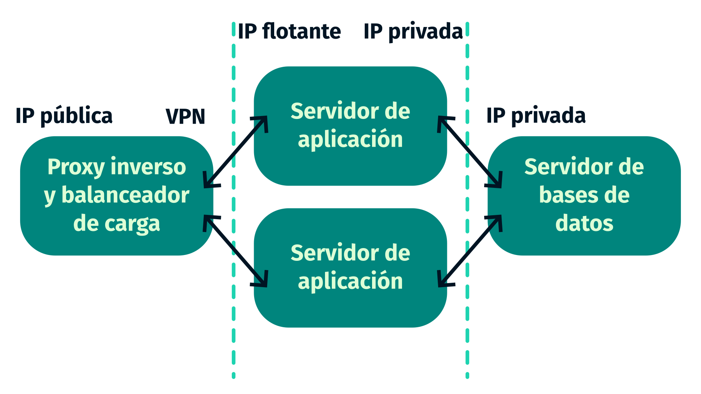
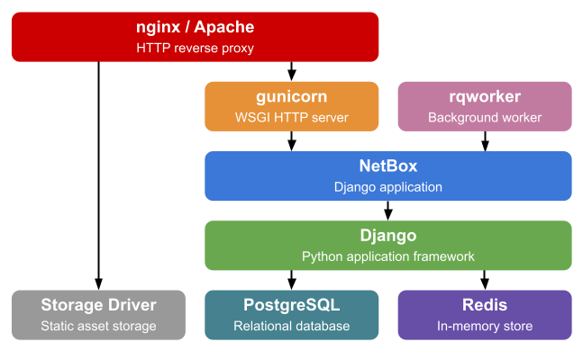
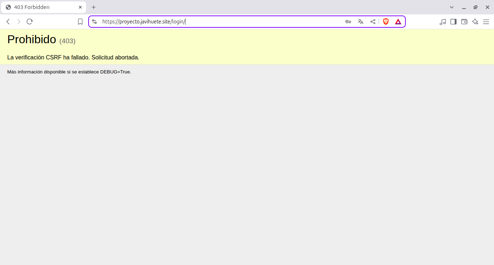

<link rel="preconnect" href="https://fonts.googleapis.com">
<link rel="preconnect" href="https://fonts.gstatic.com" crossorigin>
<link href="https://fonts.googleapis.com/css2?family=Fira+Sans:wght@400;700;800;900&display=swap" rel="stylesheet">
<link rel="preconnect" href="https://fonts.googleapis.com">
<link rel="preconnect" href="https://fonts.gstatic.com" crossorigin>
<link href="https://fonts.googleapis.com/css2?family=Fira+Code&display=swap" rel="stylesheet">

# Despliegue de la aplicación Python de gestión de la infraestructura de red NetBox mediante la especificación ASGI y usando Caddy como proxy inverso

Francisco Javier Huete Mejías

## Índice

- [1. Objetivos del proyecto](#1-objetivos-del-proyecto)
- [2. Escenario para la realización del proyecto](#2-escenario-para-la-realización-del-proyecto)
- [3. Fundamentos teóricos y conceptos](#3-fundamentos-teóricos-y-conceptos)
    - [3.1. NetBox](#31-netbox)
        - [3.1.1. IPAM](#311-ipam)
        - [3.1.2. DCIM](#312-dcim)
    - [3.2. ASGI](#32-asgi)
        - [3.2.1. La especificación ASGI](#321-la-especificación-asgi)
        - [3.2.2. ASGI vs WSGI](#322-asgi-vs-wsgi)
        - [3.2.3. Servidores de aplicaciones ASGI](#323-servidores-de-aplicaciones-asgi)
            - [3.2.3.1. Uvicorn](#3231-uvicorn)
            - [3.2.3.2. Daphne](#3232-daphne)
            - [3.2.3.3. Hypercorn](#3233-hypercorn)
            - [3.2.3.4. Granian](#3234-granian)
            - [3.2.3.5. NGINX unit](#3235-nginx-unit)
        - [3.2.4. Ventajas y desventajas del uso de la especificación ASGI para servir aplicaciones web Python](#324-ventajas-y-desventajas-del-uso-de-la-especificación-asgi-para-servir-aplicaciones-web-python)
    - [3.3. Caddy](#33-caddy)
        - [3.3.1. Introducción a Caddy](#331-introducción-a-caddy)
            - [3.3.1.1. El servidor web Caddy](#3311-el-servidor-web-caddy)
            - [3.3.1.2. Características fundamentales de Caddy](#3312-aracterísticas-fundamentales-de-caddy)
            - [3.3.1.3. Funcionalidades de Caddy](#3313-funcionalidades-de-caddy)
            - [3.3.1.4. Métodos de configuración de Caddy](#3314-métodos-de-configuración-de-caddy)
                - [3.3.1.4.1. Configuración mediante el Caddyfile](#33141-configuración-mediante-el-caddyfile)
                - [3.3.1.4.2. Configuración mediante un documento JSON](#33142-configuración-mediante-un-documento-json)
                - [3.3.1.4.3. Configuración mediante la API RESTful](#33143-configuración-mediante-la-api-restful)
            - [3.3.1.5. Configuración del protocolo HTTPS y gestión de certificados TLS en Caddy](#3315-configuración-del-protocolo-https-y-gestión-de-certificados-tls-en-caddy)
        - [3.3.2. Diferencias entre Caddy y otros servidores web tradicionales](#332-diferencias-entre-caddy-y-otros-servidores-web-tradicionales)
            - [3.3.2.1. Diferencias en su arquitectura y funcionamiento](#3321-diferencias-en-su-arquitectura-y-funcionamiento)
            - [3.3.2.2. Diferencias en su configuración](#3322-diferencias-en-su-configuración)
            - [3.3.2.3. Diferencias en la gestión de certificados SSL/TLS](#3323-diferencias-en-la-gestión-de-certificados-ssltls)
        - [3.3.3. Ventajas y desventajas del uso de Caddy como servidor web](#333-ventajas-y-desventajas-del-uso-de-caddy-como-servidor-web)
        - [3.3.4. Implantación de Caddy en el mercado](#334-implantación-de-caddy-en-el-mercado)
- [4. Descripción detallada de los pasos realizados](#4-descripción-detallada-de-los-pasos-realizados)
    - [4.1. Instalación de NetBox](#41-instalación-de-netbox)
        - [4.1.1. Servidor de bases de datos](#411-servidor-de-bases-de-datos)
            - [4.1.1.1. Instalación de Postgres](#4111-instalación-de-postgres)
            - [4.1.1.2. Creación de la base de datos](#4112-creación-de-la-base-de-datos)
            - [4.1.1.3. Instalación de Redis](#4113-instalación-de-redis)
        - [4.1.2. Servidor de aplicación](#412-servidor-de-aplicación)
            - [4.1.2.1. Instalación de dependencias](#4121-instalación-de-dependencias)
            - [4.1.2.2. Descarga de la aplicación](#4122-descarga-de-la-aplicación)
            - [4.1.2.3. Creación del usuario en el sistema operativo](#4123-creación-del-usuario-en-el-sistema-operativo)
            - [4.1.2.4. Configuración de la aplicación](#4124-configuración-de-la-aplicación)
                - [4.1.2.4.1. ALLOWED_HOSTS](#41241-allowed_hosts)
                - [4.1.2.4.2. DATABASES](#41242-databases)
                - [4.1.2.4.3. REDIS](#41243-redis)
                - [4.1.2.4.4. SECRET_KEY](#41244-secret_key)
                - [4.1.2.4.5. CSRF_TRUSTED_ORIGINS](#41245-csrf_trusted_origins)
            - [4.1.2.5. Instalación de la aplicación](#4125-instalación-de-la-aplicación)
            - [4.1.2.6. Creación del súper usuario](#4126-creación-del-súper-usuario)
            - [4.1.2.7. Programación de las tareas de limpieza](#4127-programación-de-las-tareas-de-limpieza)
            - [4.1.2.8. Prueba de funcionamiento de la aplicación](#4128-prueba-de-funcionamiento-de-la-aplicación)
        - [4.1.3. Instalación del servidor ASGI](#413-instalación-del-servidor-asgi)
            - [4.1.3.1. Instalación de Daphne](#4131-instalación-de-daphne)
            - [4.1.3.2. configuración de Daphne](#4132-configuración-de-daphne)
        - [4.1.4. Configuración del almacenamiento compartido](#414-configuración-del-almacenamiento-compartido)
            - [4.1.4.1. Instalación y configuración del servidor NFS](#4141-instalación-y-configuración-del-servidor-nfs)
            - [4.1.4.2. Instalación y configuración de los clientes NFS](#4142-instalación-y-configuración-de-los-clientes-nfs)
    - [4.2. Hacer la aplicación accesible](#42-hacer-la-aplicación-accesible)
        - [Configuración de la conexión VPN](#421-configuración-de-la-conexión-vpn)
        - [4.2.2. Instalación de Caddy](#422-instalación-de-caddy)
        - [4.2.3. Configuración de Caddy](#423-configuración-de-caddy)
            - [4.2.3.1. Configuración de Caddy en los servidores de aplicación](#4231-configuración-de-caddy-en-los-servidores-de-aplicación)
            - [4.2.3.2. Configuración de Caddy en el servidor expuesto a Internet](#4232-configuración-de-caddy-en-el-servidor-expuesto-a-internet)
    - [4.3. Carga de datos en la aplicación](#43-carga-de-datos-en-la-aplicación)
        - [4.3.1. Carga de datos manual](#431-carga-de-datos-manual)
        - [4.3.2. Carga de datos usando la API](#432-carga-de-datos-usando-la-api)
        - [4.3.3. Carga de datos en lote](#433-carga-de-datos-en-lote)
        - [4.3.4. Carga de datos usando Ansible](#434-carga-de-datos-usando-ansible)
- [5. Dificultades que se han encontrado](#5-dificultades-que-se-han-encontrado)
- [6. Conclusiones y propuestas para seguir trabajando](#6-conclusiones-y-propuestas-para-seguir-trabajando)
- [7. Bibliografía](#7-bibliografía)

<div class="page"/>

# 1. Objetivos del proyecto

El objetivo principal de este proyecto es implantar en un servidor la aplicación NetBox. Para alcanzar este objetivo último se plantean diferentes metas intermedias. En primer lugar, es necesario contar con el entorno necesario para la implantación de esta aplicación. NetBox es una aplicación escrita en Python usando el framework Django, por tanto se debe ejecutar en un equipo que cuente con un servidor de aplicaciones capaz de ejecutar código escrito en este lenguaje. Por otra parte, esta aplicación depende de una base de datos Postgres para almacenar la información más duradera y de Redis para gestionar la información de acceso habitual y caché, de manera que estas herramientas deben instalarse también en un servidor de bases de datos al que debe poder acceder el servidor de aplicaciones. Por último, para servir el contenido estático de la aplicación, la máquina debe contar también con un servidor web.

Al cumplir todas estas metas parciales, se podrá llegar al objetivo último del proyecto, que es poder acceder y usar la aplicación. Además,durante este proceso, se pretenden alcanzar otros objetivos secundarios. Por ejemplo, también es un objetivo de este proyecto recabar, organizar y trasladar la información relevante disponible sobre el protocolo ASGI, usado por algunos servidores de aplicaciones python para servir contenido dinámico. Igualmente, también se plantea como objetivo de este proyecto investigar y entender el funcionamiento del servidor web Caddy, así como poder mostrar las ventajas que ofrecen algunas de sus características más particulares y diferenciales del resto de servidores web disponibles y de uso más habitual como, por ejemplo, los diferentes métodos de configuración o la gestión automática de certificados para facilitar el uso del protocolo HTTPS en la navegación por Internet.

De forma transversal a los diferentes objetivos más particulares que se plantean para este proyecto, también se pretende mantener en todo momento una perspectiva realista del proceso de implantación de una aplicación en un entorno de producción real. Esto obliga a tener en cuenta aspectos relevantes para esta fase del despliegue de un producto como, por ejemplo, la disponibilidad de la propia aplicación o la seguridad de los datos almacenados.

Por todo esto, se puede entender que éste es un proyecto modular en el que se persigue alcanzar diferentes objetivos que giran todos ellos en torno a un objetivo principal pero que, sin embargo, no es necesariamente el más relevante o complejo dentro del proyecto. Así, se pueden estructurar los objetivos del proyecto de la siguiente forma:

- Objetivo principal: implantar la aplicación NetBox en un servidor
    - El protocolo ASGI
        - ¿Qué es el protocolo ASGI?
        - ¿Qué diferencias existen entre el protocolo ASGI y el protocolo WSGI?
        - ¿Qué servidores de aplicaciones usan el protocolo ASGI?
        - ¿Cómo se implanta una aplicación usando el protocolo ASGI?
    - El servidor web Caddy
        - ¿Qué es Caddy?
        - ¿Qué diferencia a este servidor web de otros más usados tradicionalmente?
        - ¿Cómo se configura un servidor web Caddy?
        - ¿Qué funciones de un servidor web tradicional puede cumplir Caddy?
        - ¿Cómo se usa Caddy como proxy inverso ante un servidor de aplicaciones Python?
        - ¿Cómo se usa Caddy como balanceador de carga?
        - ¿Cómo se configura el protocolo HTTPS de forma automática con Caddy?
        - ¿Cómo se gestionan los certificados de un dominio con Caddy?
    - Gestión de la red con NetBox
        - ¿Qué información de una infraestructura de red permite almacenar NetBox?
        - ¿Cómo se gestiona la información de una infraestructura en NetBox?

<div class="page"/>

# 2. Escenario para la realización del proyecto

La decisión relativa al escenario sobre el que se implantará la aplicación NetBox en este proyecto es determinante para poder conseguir algunos de los objetivos planteados en el punto anterior. De esta manera, se establece un escenario multiservicio en el que diferentes máquinas se encargarán de ejecutar los diferentes procesos que permiten el funcionamiento de la aplicación.

En primer lugar, para alcanzar el objetivo principal de servir la aplicación NetBox, se usarán dos máquinas virtuales en OpenStack. Una de ellas, alojará los servidores Postgres y Redis que NetBox necesita para funcionar. Esta máquina usará exclusivamente una dirección IP de la red interna del proyecto de OpenStack porque no es necesario acceder a ella desde el exterior. La otra se encargará de ejecutar el código Python en un servidor de aplicaciones y también alojará el contenido estático en la estructura de directorios propia de los proyectos que usan el framework Django. Esta segunda máquina contará, además, con un servidor web que hará las veces de proxy inverso como intermediario entre el cliente y el servidor de aplicaciones. Por tanto, como esta máquina debe ser accesible desde fuera del proyecto de OpenStack, en este caso sí debe contar con una dirección IP flotante.

En segundo lugar, para demostrar las características particulares del servidor web Caddy en la gestión de certificados de un dominio y de configuración específica para su uso con el protocolo HTTPS, es necesario usar tanto un dominio como una máquina que tenga alguna de sus interfaces expuestas a Internet. Para trabajar esta parte del proyecto se usará un VPS contratado en una plataforma del proveedor de cloud computing OVH, que cuenta con una interfaz y una IP públicas que dan a Internet. En él, se instalará el servidor web Caddy y se configurará para la gestión automática de los certificados del dominio `javihuete.site`. En esta máquina, la única función del servidor web será la de un proxy inverso que se encarga de redirigir el tráfico -a través de una VPN entre su red y la red local del instituto en la que se encuentra el proyecto de OpenStack- hacia la máquina que sirve la aplicación.

Por último, en el camino hacia la consecución del objetivo de comprender el funcionamiento de Caddy como balanceador de carga, se hace necesario trabajar con una nueva máquina. Se trata de una segunda máquina similar a una de las creadas anteriormente que también se encargará de ejecutar el código Python en un servidor de aplicaciones así como de el contenido estático de la propia aplicación. Como en el caso anterior, esta máquina también necesita una IP flotante para ser accedida desde fuera del proyecto de OpenStack. El servidor web Caddy que hace la función de balanceador de carga será el instalado en el VPS contratado en OVH, que hace de punto de acceso a la aplicación. Para garantizar la integridad de los datos, ambos servidores de aplicaciones acceden al mismo servidor de bases de datos que almacena la información de la aplicación.

De esta manera, se puede representar el escenario en el que se desarrollará este proyecto en el siguiente esquema:



<div class="page"/>

# 3. Fundamentos teóricos y conceptos

## 3.1. NetBox

NetBox es una aplicación web escrita en Python usando el framework Django que permite gestionar y administrar la infraestructura de una red local. Esta aplicación usa una base de datos PostgresSQL para almacenar la información y Redis para la gestión de tareas. Además, también requiere de un servicio WSGI como gunicorn o uWSGI y un servidor web como Nginx o Caddy para servir la aplicación.

Esta aplicación ofrece una solución que permite modelar y documentar redes actuales. Combina las disciplinas tradicionales de la gestión de direcciones IP (IPAM o IP address management) con la de gestión de la infraestructura del centro de datos (DCIM o datacenter infrastructure management). Además cuenta con importantes APIs y extensiones.

El desarrollador original de NetBox es su mantenedor principal en la actualidad, Jeremy Stretch, que trabajaba como ingeniero de red en DigitalOcean en 2015 con el objetivo de automatizar sus tareas de aprovisionamiento en lo relacionado con su red. En este contexto, creó esta herramienta que la compañía decidió liberar como un proyecto de software libre en junio de 2016.

Desde entonces, miles de organizaciones del mundo han adoptado esta herramienta que, en la actualidad, está administrada por NetBox Labs y un equipo de mantenedores voluntarios. Más allá del producto principal, la comunidad de NetBox ha desarrollado un sinfín de complementos para incrementar y expandir las características de esta herramienta.

### 3.1.1. IPAM

NetBox es una aplicación originalmente desarrollada para servir a las necesidad de los ingenieros y operadores de redes. Por eso combina dos disciplinas fundamentales en este sector. Una de ellas es la gestión de direcciones IP (IPAM, por sus siglas en inglés.).

IPAM es una disciplina que se encarga de planificar, organizar, hacer seguimiento, auditar, monitorizar, ajustar la información y administrar las direcciones IP y las subredes usadas en una red de manera centralizada.

Tal y como se aclara en la documentación de NetBox, la IPAM no se encarga de gestionar y administrar los nombres de dominio, como se hace al configurar un servidor DNS, ni tampoco se centra en la configuración dinámica de los hosts como ocurre con los servidores DHCP. Sin embargo, algunas aplicaciones para la administración de direcciones IP como NetBox sí incluyen herramientas que permiten, por ejemplo, aprovisionar la siguiente dirección IP de un rango de manera automática a una máquina inventariada.

Las herramientas usadas para la IPAM suelen almacenar información como las direcciones IP que se están usando actualmente en una red, los dispositivos a los que está asignada cada una de esas direcciones IP, la fecha y hora a la que se ha asignado cada una de ellas o el usuario al que está vinculada la dirección.

Este tipo de herramientas suele contar, como ocurre en el caso de NetBox, para soporte tanto para direcciones IPv4, como para direcciones IPv6, con las particularidad propias de cada caso. En el caso de la gestión de direcciones IPv4, la complejidad reside en la división de la red en subredes y la necesaria administración no sólo de las direcciones, sino también de las redes y máscaras de red en cada caso. Al gestionar direcciones IPv6, la complejidad está más relacionada con la dificultad para leer e interpretar estas direcciones, expresadas en números hexadecimales.

### 3.1.2. DCIM

Por su parte, la gestión de la infraestructura del centro de datos (DCIM, por sus siglas en inglés) consiste en la integración de las disciplinas de administración de empresas tradicionales de tecnologías de la información y de gestión de instalaciones. Se trata de centralizar la monitorización, gestión y planificación de los sistemas críticos que constituyen los centros de datos.

Habitualmente, esta gestión de la infraestructura se realiza a través del uso de software, hardware y sensores especializados que permiten una monitorización en tiempo real y una herramienta de administración para todos los sistemas integrados en las instalaciones de infraestructuras tecnológicas. Un caso de uso muy habitual de estos sistemas de monitorización es medir el consumo energético de los CPD.

La DCIM pretende otorgar a los administradores de las infraestructuras una visión holística del funcionamiento, rendimiento, consumo y eficiencia del centro de datos en términos de consumo de energía eléctrica, rendimiento de los equipos o, incluso, aprovechamiento del espacio disponible.

Una característica habitual en las herramientas empleadas para la DCIM es la creación de diagramas, croquis y planos que permiten mostrar de forma clara y concisa la ubicación de los diferentes equipos en el CPD, las conexiones entre ellos o la ubicación de las diferentes tomas de corriente o de red. Esta información puede ser muy útil y relevante a la hora de realizar tareas de mantenimiento en el centro o cuando se debe decidir la ubicación de nuevos equipos.

## 3.2. ASGI

### 3.2.1. La especificación ASGI

El Protocolo de Interfaz de Servidor Asíncrono (ASGI, por sus siglas en inglés) es un estándar desarrollado para que los servidores web puedan reenviar las peticiones que reciben a los frameworks y aplicaciones Python que han sido escritas con las características necesarias para poder ejecutarse de forma asíncrona. Este protocolo se considera una evolución fundamental en el contexto de las aplicaciones web escritas en Python porque viene a suceder o relevar al Protocolo de Interfaz de Servidor Web (WSGI, por sus siglas en inglés), que ha sido tradicionalmente el estándar para la comunicación entre los servidores web, frameworks y aplicaciones Python.

A diferencia del tradicional WSGI, el protocolo ASGI se marca como objetivo principal funcionar a modo de interfaz estándar de comunicación entre servidores web y aplicaciones Python para manejar operaciones asíncronas en aquellos casos en los que las aplicaciones Python puedan aprovechar estas capacidades.

Mientras que el protocolo WSGI se diseñó originalmente para servir aplicaciones síncronas y sólo tiene capacidad para trabajar con este tipo de aplicaciones, ASGI incluye soporte tanto para aplicaciones asíncronas como síncronas. ASGI es un protocolo de más reciente diseño y ha tenido en cuenta también esta versatilidad, imprescindible para permitir una transición gradual desde las aplicaciones existentes, que aún no contemplan las características que permite este nuevo paradigma de la programación hacia nuevas versiones de estas aplicaciones que ya empiecen a beneficiarse de estas nuevas características asíncronas. Igualmente, también facilita la creación de nuevas aplicaciones que ya incluyan este tipo de características.

Desde su diseño, esta especificación ha puesto el foco en modernizar la forma en la que las aplicaciones Python interactúan con los servidores web y los clientes. Por ello, destaca como una características fundamental de ASGI que es capaz de admitir diferentes estilos de protocolo, no sólo puede gestionar peticiones y respuestas HTTP, sino que también puede trabajar con protocolos como HTTP/2 y WebSocket.

El reciente auge de protocolos como WebSockets, que han ganado presencia en el entorno de las aplicaciones web modernas en los últimos tiempos, así como las nuevas posibilidades que permite el nuevo paradigma de la programación asíncrona, han hecho necesario el diseño de esta nueva especificación para superar las limitaciones que presentaba su contraparte síncrona, WSGI, en estos aspectos.

WSGI había sido una especificación totalmente funcional y eficiente para servir aplicaciones web escritas en Python durante años, cuando la programación asíncrona en este lenguaje aún no estaba muy extendida. Sin embargo, el lanzamiento de la versión 3.5 de este popular lenguaje de programación incluye, por primera vez, las palabras clave `async` y `await`. Con esta innovación, el lenguaje permite a los desarrolladores nuevas posibilidades y muchos de ellos comienzan a orientar sus aplicaciones a este nuevo paradigma de programación asíncrona que, por sus ventajas frente al modelo de procesamiento síncrono que usa WSGI, gana cada vez más popularidad.

El auge de la programación asíncrona en Python puso de relieve las limitaciones de la tradicional especificación WSGI para permitir aprovechar las nuevas capacidades que el lanzamiento de la versión 3.5 de Python aportaba a las aplicaciones escritas usando este lenguaje. Así, surge la necesidad una nueva especificación que permitiese aprovechar estas nuevas funcionalidades.

En este contexto, y ante la necesidad de un estándar que pudiera remediar las limitaciones que estaba presentando WSGI tanto en el manejo de los nuevos protocolos como en los escenarios que demandan una alta concurrencia, el proyecto Django Channels propone el diseño de la nueva especificación ASGI en 2017. La publicación de su primera versión supuso un hito en la historia del desarrollo web con Python. La versión actual de este estándar, la 3.0, se publicó en 2019 y supuso, hasta la fecha, la consolidación definitiva de este protocolo.

El paso desde el uso generalizado del estándar WSGI hacia la cada vez mayor presencia de la nueva especificación ASGI en la implantación de aplicaciones web Python muestra como el ecosistema de aplicaciones escritas en este lenguaje de programación ha sido capaz de adaptarse, una vez más, a los cambios y demandas de un sector, el del desarrollo de aplicaciones web, que está en constante innovación y que tiene, cada vez, unas exigencias mayores.

### 3.2.2. ASGI vs WSGI

Como se ha explicado anteriormente, tanto WSGI como ASGI son especificaciones que permiten la comunicación entre los servidores web y las aplicaciones web desarrolladas en Python pero se diferencian en que el primero opera bajo un modelo síncrono mientras que el segundo lo hace de forma asíncrona. Pero, ¿qué significa esto?

El protocolo WSGI está desarrollado bajo un modelo de programación síncrono, de manera que maneja las solicitudes que recibe de forma secuencial, es decir, este estándar bloquea su ejecución cada vez que recibe una petición hasta que el procesamiento de la solicitud actual se ha completado y sólo cuando esto ocurre pasa a resolver la siguiente petición.

Por su parte, el protocolo ASGI se desarrolló bajo un modelo de programación asíncrono y, por tanto, permite procesar diferentes peticiones a la vez de forma paralela sin necesidad de bloquear otros procesos. Esta características de la especificación ASGI es posible gracias a que, desde la versión 3.5 de Python se incluyen las palabras calve `async` y `await`. Con estas palabras clave se pueden crear construcciones más ligeras y eficientes que los hilos o procesos tradicionales llamadas corrutinas async/await y que permiten a este estándar gestionar de forma eficiente la concurrencia de peticiones al servidor. Esta innovación ha permitido importantes mejoras tanto en el rendimiento como en la escalabilidad de las aplicaciones web Python.

Esta diferencia entre ambas especificaciones tiene una implicación directa muy importante en términos de rendimiento a la hora de ejecutar código Python para servir aplicaciones web en un servidor y, por tanto, a la hora de manejar y responder peticiones. La naturaleza secuencial con la que se diseñó el estándar WSGI, que procesa cada petición HTTP que recibe de manera secuencial en un único hilo o proceso, supone una limitación en la capacidad de respuesta de las aplicaciones. Esta limitación se hace especialmente evidente cuando las tareas requieren un tiempo de procesamiento largo. En estos casos, el servidor espera a que se termine de procesar una petición antes de atender a la siguiente.

En cambio, la capacidad de respuesta y la concurrencia de las aplicaciones mejora notablemente cuando se usa el estándar ASGI. Esto se debe a que este protocolo permite el procesamiento paralelo de múltiples peticiones HTTP. Pero esta no es la única ventaja de esta especificación, sino que también es capaz de manejar de manera eficiente conexiones en tiempo real como las que utilizan protocolos como long-polling o WebSockets, así como otros protocolos que no son compatibles de forma nativa con WSGI.

Esto hace que, a día de hoy, ASGI pueda gestionar una variedad mayor de patrones de comunicación entre servidores web y aplicaciones Python y que, por tanto, sea una solución más completa y adecuada para enfrentarse a las circunstancias en las que se desarrollan y sirven las aplicaciones web modernas en la actualidad.

Otra diferencia fundamental entre estas dos especificaciones es que mientras que WSGI sólo ofrece soporte para la versión 1.1 del protocolo HTTP, ASGI cuenta, además, con soporte nativo tanto para la versión 2 de este protocolo de comunicación muy ampliamente extendido así como para WebSockets. Al soportar estos nuevos protocolos, ASGI permite a las aplicaciones web Python usar características que no podían aprovechar hasta el momento. 

Por ejemplo, gracias al protocolo HTTP/2, ASGI permite a las aplicaciones web usar el server push, una característica que permite al servidor enviar recursos al cliente de forma proactiva. Esto hace que disminuyan tanto la latencia de las aplicaciones como el número de peticiones necesario para cargar una página. Así, se consigue mejorar drásticamente el rendimiento de las aplicaciones web.

También la implementación del protocolo WebSockets en esta nueva especificación para servir aplicaciones web Python permite que estas aplicaciones puedan incluir características interactivas puesto que este protocolo permite la comunicación no sólo bidireccional, sino también en tiempo real entre el cliente y el servidor.

Como se ha venido desarrollando anteriormente, un punto clave en el que se diferencia estas dos especificaciones es en el de la concurrencia y escalabilidad de las aplicaciones. En el caso de WSGI, este estándar ha permitido tradicionalmente la concurrencia de peticiones mediante el uso de múltiples procesos o hilos. Esta perspectiva implica siempre un consumo de recursos del sistema más elevado que se puede llegar a hacer insostenible cuando las cargas son elevadas. 

Sin embargo, ASGI aborda este problema desde una perspectiva diferente que le ha permitido manejar de forma más eficiente la concurrencia de peticiones al usar corrutinas asíncronas que se pueden ejecutar en un único hilo o proceso de forma simultánea. Esto supone un consumo de recursos del sistema significativamente menor que el que supone el planteamiento que establecía el estándar WSGI. 

De esta manera, en entornos en los que las aplicaciones pueden verse expuestas a situaciones en las que deben soportar un gran número de conexiones concurrentes, la capacidad de escalabilidad de estas aplicaciones para adaptarse a volúmenes elevados de solicitudes es mayor cuando estas usan la especificación ASGI. En el contexto actual, en el que es muy habitual que las aplicaciones web cuenten con bases de usuarios que pueden experimentar un crecimiento constante o, en ocasiones, un gran crecimiento puntual, esta característica es fundamental para la mayoría de aplicaciones web.

La última diferencia fundamental entre estos dos protocolos reside en el manejo del middleware. Cada uno de ellos se acercan a esta cuestión de una forma diferente condicionada por su propio diseño de origen. Así, en el caso de WSGI, el middleware opera, al igual que esta especificación, de manera síncrona. Esto puede generar cuellos de botellas y afectar de esta manera al rendimiento cuando el código de la aplicación incluye algún elemento asíncrono. En cambio, en el caso de ASGI, el middleware soporta operaciones asíncronas de la misma manera que lo hace en su diseño la propia especificación.

El hecho de que el protocolo ASGI esté diseñado para soportar middleware asíncrono garantiza la compatibilidad y el rendimiento óptimo de todas aquellas aplicaciones que, en su código, se benefician de algunas de las características de la asincronía que Python pone a disposición de quienes desarrollan aplicaciones. De esta manera, este tipo de middleware puede interceptar y procesar tanto las peticiones como las respuestas de manera no bloqueante.

Igualmente, cabe destacar también que el estándar ASGI cuenta con mecanismos que permiten integrar componentes de middleware que se pueden encargar de autenticar conexiones o usuarios, preprocesar peticiones o añadir encabezados personalizados a las respuestas que devuelve la aplicación.

### 3.2.3. Servidores de aplicaciones ASGI

Desde que en 2017 el proyecto Django Channels publicara la primera versión de la especificación ASGI, han sido varios los proyectos de servidores de aplicaciones que han surgido en torno a este nuevo estándar de comunicación entre servidores web y aplicaciones Python.

#### 3.2.3.1. Uvicorn

Uno de los servidores de aplicaciones ASGI más populares en la actualidad es Uvicorn. Este servidor de aplicaciones se caracteriza por su rapidez, alto rendimiento y bajo consumo de recursos y soporta los protocolos HTTP/1.1 y WebSockets. En los últimos tiempos se ha generalizado su uso para servir aplicaciones desarrolladas con el framework FastAPI.

Una particularidad propia de este servidor de aplicaciones es que puede operar de forma independiente pero también puede integrarse como un worker dentro de Gunicorn para despliegues en producción. Esta opción permite aunar las ventajas que ofrece Uvicorn con las grandes capacidades de Gunicorn para la gestión de procesos.

#### 3.2.3.2. Daphne

De gran popularidad goza también el servidor de aplicaciones Daphne, el servidor de referencia para la especificación ASGI desarrollado y mantenido como parte del propio proyecto Django Channels, creador de esta especificación. Este servidor de aplicaciones Python cuenta con soporte para los protocolos HTTP en sus versiones 1.1 y 2 así como para WebSockets.

Su vinculación con el proyecto Django Channels hace que sea un servidor muy ligado al framework Django y que la integración con las características propias de este framework sea casi natural. Por eso, Daphne se ha convertido en el servidor de referencia para las aplicaciones que usan este framework, especialmente, cuando incluyen funcionalidades que requieren la interacción en tiempo real a través de WebSockets.

Una características propia de este servidor es que su estrecha vinculación a un proyecto tan asentado en la comunidad de desarrollo de Python como Django garantiza no sólo la compatibilidad con las aplicaciones sino también el soporte y mantenimiento a largo plazo.

#### 3.2.3.3. Hypercorn

Otro servidor ASGI relevante es Hypercorn, que se diferencia de los anteriores porque no sólo es compatible con WebSockets y las versiones 1.1 y 2 del protocolo HTTP, sino que también permite alcanzar la compatibilidad con el protocolo HTTP/3 mediante la biblioteca `aioquic` de Python. 

Además, es un servidor de aplicaciones compatible tanto con la especificación ASGI como con WSGI. Esta característica ofrece una gran flexibilidad para servir una mayor variedad de aplicaciones que los otros servidores, que sólo son compatibles con la especificación ASGI.

Hypercorn surge como parte del framework Quart pero, posteriormente, se escindió de él para funcionar como un servidor de aplicaciones ASGI independiente. Este servidor se caracteriza por ofrecer una enorme versatilidad y por soportar los estándares más recientes y actuales de protocolos web.

#### 3.2.3.4. Granian

Granian es un servidor HTTP de cierta notoriedad en la actualidad, escrito en Rust y diseñado para aplicaciones Python. Este servidor incluye soporte tanto para las interfaces ASGI y WSGI como para otros estándares de comunicación entre servidores web y aplicaciones Python como RSGI. Su característica más relevante es su alto rendimiento y su bajo consumo de recursos.

#### 3.2.3.5. Nginx Unit

El proyecto Nginx, que desarrolla uno de los servidores web más extendidos y usados en la actualidad, ofrece también Unit. Nginx Unit no es realmente un servidor de aplicaciones como el resto de los que se recoge en este documento, sino que más bien pretende ser una solución integral para el despliegue de aplicaciones web. Se trata de un servidor web ligero y adaptable con soporte ASGI para Python 3.5 y posterior incluido. Pero, además, este servidor web es capaz de servir contenido estático, ejecutar código en múltiples lenguajes y actuar como proxy inverso.

### 3.2.4. Ventajas y desventajas del uso de la especificación ASGI para servir aplicaciones web Python

Aunque ya se ha mencionado, si no la totalidad, al menos sí la mayoría de las ventajas que ofrece el uso del protocolo ASGI en la implantación de aplicaciones web Python conviene en este punto recapitular y recopilar esta información.

De lo ya presentado en este proyecto se desprende que la ventaja más relevante que ofrece el uso de este protocolo a la hora de implantar y servir aplicaciones web Python es el mejor rendimiento que permite, especialmente en aquellos casos en los que la aplicación realiza una gran cantidad de operaciones de entrada/salida como, por ejemplo, cuando una aplicación tiene una nivel muy alto de interacción con una base de datos o con una API externa.

En estos casos, la naturaleza asíncrona de la especificación ASGI permite que el servidor sea capaz de gestionar mucho mejor estas operaciones de forma simultánea sin bloquear el proceso principal. De esta manera, la aplicación puede ofrecer una mayor capacidad de respuesta y, por tanto, un rendimiento mayor.

También se ha mencionado previamente una ventaja importante de este estándar, que ofrece soporte nativo para protocolos web más modernos y actuales como WebSockets o la versión 2 de HTTP. Esto permite que ASGI facilite la comunicación bidireccional en tiempo real entre servidor y cliente a través de WebSockets o que las transferencias de recursos web se puedan realizar de forma más eficiente a través de HTTP/2.

Además, ASGI ofrece una ventaja fundamental a la hora de servir aplicaciones que cuenten con un gran número de usuarios activos o que necesiten mantener conexiones persistentes. Y es que, como ya se ha explicado anteriormente, esta especificación permite una mayor concurrencia que su predecesora, WSGI, gracias a su modelo de programación asíncrono basado en corrutinas que le permiten gestionar un número mayor de conexiones simultáneas.

Por último, cabe destacar que el modelo de mensajería de ASGI permite que las aplicaciones sigan ejecutando código incluso después de haber enviado la respuesta HTTP al cliente. Esto hace que la ejecución de tareas en segundo plano se mucho más sencilla.

Sin embargo, para que una aplicación web Python llegue a aprovechar realmente estas ventajas no es suficiente con usar un servidor de aplicaciones ASGI para servirla, sino que debe modificar su propio código para incluir las funcionalidades necesarias que le permitan aprovechar estas ventajas del paradigma de la programación asíncrona. 

Este es uno de los principales inconvenientes que presenta la implantación de la especificación ASGI en el proceso de implantación de aplicaciones web Python. Precisamente, la programación asíncrona supone una mayor complejidad en comparación con el modelo síncrono que la mayoría de personas que se dedican a la programación conocen y dominan. Esto ocurre especialmente con quienes ya se han habituado a trabajar con estos frameworks y con especificaciones previas como WSGI. Además, la depuración del código asíncrono también puede ser más difícil y costosa y exige el uso de un conjunto diferente de herramientas y técnicas que no todas las personas que desarrollan sus aplicaciones web con Python conocen.

Por otra parte, aunque ASGI se ha diseñado desde su origen teniendo el cuenta el proceso de migración de las aplicaciones desde WSGI y lo facilita en gran medida, es cierto que se pueden presentar problemas de incompatibilidades, sobre todo en aquellos casos en los que la aplicación usa middleware o extensiones específicas del protocolo WSGI. A día de hoy, no todas las funcionalidades y extensiones propias de WSGI cuentan con un equivalente directo en la especificación ASGI y, además, la ejecución de código síncrono dentro de un entorno ASGI puede provocar una sobrecarga en los procesos si no se gestiona de forma adecuada.

Por último, es necesario apuntar a un posible cuello de botella que se puede producir si no se completa el proceso de migración desde una aplicación WSGI a una aplicación ASGI de forma correcta. Este punto débil está en el mapeo relacional de objetos (ORM, por sus siglas en inglés), que es la parte del código que se encarga de convertir los datos entre el sistema de tipos utilizado por la aplicación y la base de datos relacional en la que la aplicación almacena estos datos. El uso de ORM síncronos en aplicaciones asíncronas puede limitar las ventajas de rendimiento que ASGI ofrece. Además, hasta la fecha, los ORM asíncronos se encuentran en un proceso de desarrollo desigual en función del sistema gestor de bases de datos que requiera cada aplicación.

| Ventajas | Desventajas |
| -------- | ----------- |
| Mejor rendimiento | Requiere modificar el código de la aplicación |
| Operaciones simultáneas sin bloquear el proceso principal | Mayor complejidad en la programación |
| Soporte nativo para protocolos más modernos | La depuración del código puede ser más difícil y costosa |
| Mayor concurrencia de procesos | Incompatibilidades con WSGI |
| Ejecución del código tras haber enviado la respuesta HTTP | Puede producirse un cuello de botella en el mapeo relacional de objetos |
> Fuente: Elaboración propia

Con todo, se puede entender que la especificación ASGI es capaz de aportar sus ventajas en aquellos casos en los que las aplicaciones incluyen funcionalidades que requieren establecer una comunicación en tiempo real como es el caso de los chats, las notificaciones push o los juegos multijugador, que suelen usar WebSockets para el que ASGI incluye soporte nativo. Así, estas aplicaciones pueden establecer conexiones persistentes y bidireccionales con los clientes y garantizar la entrega instantánea de información para conseguir una experiencia de usuario más interactiva.

Igualmente, es un estándar especialmente recomendado en los casos en los que una aplicación experimenta un gran número de conexiones simultáneas, como puede ocurrir con webs de alto tráfico, APIs públicas o plataformas con una gran cantidad de usuarios, puesto que el modelo asíncrono propio de ASGI permite manejar esta mayor carga de tráfico y este mayor número de conexiones concurrentes de una forma más eficiente mientras que el uso de WSGI en estos contextos puede generar un cuello de botella cuando la aplicación se enfrenta a cargas elevadas.

Como se ha apuntado anteriormente, también supone un caso de uso habitual del protocolo ASGI aquellas aplicaciones que necesitan realizar operaciones durante un largo período de tiempo porque la naturaleza asíncrona de este estándar permite que, durante este tiempo, no se bloquee el hilo o proceso principal y el servidor pueda seguir resolviendo peticiones sin demoras significativas. Esto permite que mientras se resuelve una petición, la aplicación pueda mantener su capacidad de respuesta. Por eso, esta especificación está indicada para aplicaciones que ejecutan de forma asíncrona tareas intensivas de entrada/salida de larga duración, como llamadas a APIs externas, procesamiento de archivos grandes o tareas de computación complejas.

Un último caso de uso en el que ASGI tiene un excelente rendimiento es el de las aplicaciones que ofrecen servicio de streaming o long-polling, puesto que este tipo de aplicaciones son las que más se pueden beneficiar de la capacidad de este protocolo para manejar eficientemente conexiones persistentes durante períodos de tiempo prolongados que permiten mantener una conexión abierta con el cliente para enviar actualizaciones en tiempo real o transmitir grandes cantidades de información de manera continua.

Con todo, parece que de cara al futuro ASGI se presenta como una especificación prometedora que, desde el momento de su diseño, ha experimentado una adopción cada vez mayor y que se espera que siga siendo así en tanto en cuanto nuevos frameworks y bibliotecas Python integren completamente las capacidades asíncronas de las que ASGI permite beneficiarse a las aplicaciones. 

Además, el soporte para los protocolos más modernos y recientes como HTTP/3 posiciona al estándar ASGI como uno de los más avanzados, modernos y actualizados en el contexto de los servidores de aplicaciones y, si bien es cierto que necesita coexistir con WSGI durante un período de transición y que esta coexistencia está totalmente contemplada en el protocolo ASGI que permite la transición y la compatibilidad de las aplicaciones desarrolladas con ambos protocolos, todo indica que puede continuar su crecimiento y se puede llegar a posicionar como la opción preferida en el futuro en el ámbito del desarrollo de aplicaciones web modernas y sofisticadas en el ecosistema Python.

## 3.3. Caddy

### 3.3.1. Introducción a Caddy

#### 3.3.1.1. El servidor web Caddy

Caddy es un servidor web de código abierto, escrito en el lenguaje de programación Go y que se caracteriza por su diseño orientado a la simplicidad, la seguridad y la potencia. Su creador, Matthew Holt, lanzó la primera versión de este servidor web en el año 2015 y, desde entonce, ha conseguido el apoyo de importantes instituciones como la Internet Infrastructure Foundation (IFF), que aporta una parte fundamental de la financiación del proyecto actualmente.

Se trata de un servidor web de muy reciente creación si se compara con otras alternativas como Apache o Nginx, lo que ha permitido a Caddy aprovechar algunos de los avances tecnológicos más actuales. En este sentido, por ejemplo, este servidor web está escrito en Go, un lenguaje de programación que le permite alcanzar una notable eficiencia en el uso de los recursos del sistema, así como un alto nivel de portabilidad entre diferentes plataformas. Esto se debe a que el compilador de este lenguaje de programación genera binarios auto-suficientes y enlazadas estáticamente que se pueden ejecutar en una amplia variedad de sistemas operativos diferentes con unas dependencias mínimas.

Además, Go se considera un lenguaje "memory safe" y esto tiene unas implicaciones relevantes en cuanto a la seguridad del servidor web Caddy puesto que esta característica del lenguaje de programación reduce la probabilidad de que sus aplicaciones sufran ciertas vulnerabilidad comunes a otros lenguajes, lo que hace que, además de ser un servidor fácil de instalar y operar en entornos diversos incluso cuando estos entornos tienen requisitos de software específicos, Caddy sea también un servidor web más seguro.

El nombre de este servidor web, Caddy, hace referencia a la idea de un asistente que facilita tareas repetitivas y tediosas y que se encarga de organizar los diferentes componentes en un sistema más simplificado. Así, el objetivo de este proyecto es hacer que el alojamiento web sea algo sencillo, fácil, automatizado y seguro, como demuestra con los diferentes mecanismos de configuración del protocolo HTTPS con los que cuenta el servidor y por sus características predeterminadas en cuanto a seguridad.

El hecho de que Caddy esté desarrollado en Go supone una diferencia sustancial respecto a otros servidores web puesto que puede contar con algunos de los beneficios propios de este lenguaje de programación, que al ser una tecnología más moderna, le permite alcanzar a Caddy un mayor nivel de rendimiento y seguridad que otros navegadores más antiguos desarrollados en otros lenguajes como, por ejemplo, C.

Un ejemplo de estos beneficios es el modelo de concurrencia de Go, que permite a Caddy manejar un gran número de conexiones simultáneas de manera eficiente. Este funcionamiento es radicalmente opuesto al de otros servidores web como el de Apache, que con su modelo basado en procesos puede resultar más intensivo en el uso de recursos del sistema, sobre todo cuando tiene que hacer frente a cargas elevadas.

Pero ¿qué hace a Caddy un servidor web diferente? Más allá de las diferencias básicas e intrínsecas al propio lenguaje de programación en el que este servidor web ha sido diseñado y desarrollado, Caddy ofrece una serie de características propias que lo alejan de la concepción previa sobre cómo debe funcionar, gestionarse y configurarse un servidor web. A continuación se recogen algunas de las características fundamentales que hacen a este servidor web diferente a los servidores web tradicionales.

#### 3.3.1.2. Características fundamentales de Caddy

Comenzando por el rasgo más distintivo de este servidor web, cabe destacar la capacidad de Caddy para gestionar de forma automática los certificados SSL/TLS usando el protocolo ACME (Automated Certificate Management Environment) a través de Let's Encrypt para obtener y renovar los certificados para todos los sitios que sirve sin necesidad de una intervención manual. Y no sólo el servidor cuenta con esta capacidad sino que, además, lo hace de forma predeterminada. Así, Caddy se convierte en uno de los servidores web más seguros con la mínima intervención durante el proceso de configuración ya que desde su primera instalación sirve, por defecto, el contenido usando el protocolo HTTPS.

No menos importante es otro de los rasgos distintivos de este servidor web: su enfoque minimalista en lo relativo a la configuración necesaria para hacer funcionar la herramienta. Uno de los principales problemas de los servidores web más antiguos es que su configuración es compleja, en ocasiones requiere trabajar con un gran número de ficheros y su sintaxis es difícil de entender. Caddy se caracteriza por usar un fichero de configuración, el Caddyfile, de sintaxis muy simple y fácilmente legible para humanos. Tanto es así que es posible hacer configuraciones sencillas y comunes, como la configuración de un proxy inverso, en una única línea de este fichero. Así, Caddy pretende facilitar enormemente la configuración de este tipo de servidores.

Otra característica fundamental de este servidor web es su arquitectura modular organizada en tres componentes principales: el comando, la librería central y los módulos de configuración o plugins. Esta particularidad convierte a Caddy en un servidor web completamente personalizable que puede ser tan ligero como el usuario necesite si crea su propia compilación personalizada eliminando los plugins innecesario pero tan completo y potente como cualquier otro navegador gracias a los módulos que permiten funcionalidades como la reescritura de URLs, la navegación de archivos, el soporte para WebSockets o la gestión de logs.

Así, Caddy incluye soporte nativo para cumplir con las principales funciones que se pueden esperar de un servidor web como pueden ser, por ejemplo, funcionar como proxy inverso, realizar un balanceo de carga entre diferentes servidores de backend, gestionar los reintentos, establecer la configuración de timeouts o la conmutación por error o failover. Este servidor web no sólo puede hacer de proxy para protocolos con HTTP, FastCGI o WebSockets, sino que también es capaz de gestionar backends dinámicos.

Muy orientadas a la seguridad y disponibilidad de los servicios ofrecidos por Caddy están otras de sus características más relevantes como la posibilidad de verificar la salud de los backend a los que dirige el tráfico o la posibilidad de realizar cambios en la configuración sin interrupciones en el servicio.

Su juventud es fruto, además, de algunas de las características fundamentales que permiten a Caddy diferenciarse de otros servidores web más tradicionales y asentados en el mercado. Por ejemplo, Caddy es uno de los pocos servidores web que cuentan a día de hoy con soporte inmediato para las versiones 2 y 3 del protocolo HTTP y para QUIC. Esta integración con las versiones más reciente de los principales protocolos web garantiza tiempos de carga más rápidos y un mejor rendimiento, especialmente para clientes que acceden al servidor web desde dispositivos móviles o a través de conexiones de red inestables.

Adicionalmente, se pueden apuntar otras características que también están en el centro de la definición de este servidor web como, por ejemplo, el servidor de archivos integrado, el soporte multiplataforma (está disponible para Linux, Windows y macOS), una API de configuración en línea o el uso eficiente de los recursos del sistema.

En definitiva, en estos diez años desde su lanzamiento, Caddy se ha conseguido posicionar como una opción muy atractiva para quienes buscan una manera rápida y segura de configurar sus servidores web evitando la complejidad propia de las herramientas tradicionales gracias a su apuesta por el HTTPS automático y la simplicidad de su sintaxis de configuración.

Por una parte, Caddy viene a romper una barrera significativa en el contexto de los servidores web: las dificultades generadas en torno a la gestión de certificados SSL/TLS, que puede ser propensa a errores y consumir mucho tiempo y que, con este servidor web se automatiza.

Por otra parte, la curva de aprendizaje para la configuración de Caddy se ve reducida a la mínima expresión gracias a la sintaxis simple del Caddyfile y al a posibilidad de configurar el servidor de manera interactiva a través de su API. Además, la arquitectura modular de este servidor web permite a los usuarios adaptarlo a sus necesidades gracias a la flexibilidad que permite el uso de plugins.

#### 3.3.1.3. Funcionalidades de Caddy

Hasta aquí se ha aportado una visión general de qué es Caddy y se han citado algunas de sus principales características, especialmente, aquellas que resultan más llamativas porque lo diferencian o lo alejan de la idea general de lo que es un servidor web si se piensa en Apache o Nginx. Es el momento de centrarse ahora en las funcionalidades propias de un servidor web que cumple Caddy.

La primera y fundamental funcionalidad que debe cumplir un servidor web es servir contenido estático y, en este sentido, Caddy es capaz de servir eficientemente archivos estáticos tales como HTML, CSS, JavaScript y contenidos multimedia. Además, permite el uso de varios algoritmos de compresión sobre la marcha como gzip o zstd, así como la publicación de archivos precomprimidos que mejoran el rendimiento. Este servidor web también admite peticiones de rango y Etags y puede servir sitios web estáticos desde sistemas de ficheros virtuales, almacenamiento en la nube o, directamente, desde bases de datos.

Además, Caddy cuenta con soporte nativo para actuar como proxy inverso para algunos de los principales y más actuales protocolos de comunicación web HTTP, HTTPS, WebSockets, gRPC o FastCGI, entre otros y puede redirigir tráfico a uno o varios servicios de backend. Esta funcionalidad de proxy inverso incluye, además, características como el balanceo de carga para distribuir el tráfico entre diferentes servidores de backend y también admite comprobaciones de salud, gestiona reintentos y establece escenarios de conmutación por error.

En cuanto a la seguridad, como ya se ha desarrollado extensamente en el apartado anterior, Caddy tiene la capacidad de gestionar de manera automática la terminación TLS para ofrecer los sitios usando el protocolo HTTPS y puede actuar como endpoint SSL.

Como todos los servidores web, Caddy cuenta con diferentes opciones configurables para el registro y almacenamiento de logs. Así, se puede determinar el formato, el nivel de verbosidad o el destino de los logs, que se pueden enviar a un fichero, a la salida estándar o a un registro remoto. Además, con el objetivo de facilitar su análisis,a través de herramientas de monitorización externa Caddy ofrece la posibilidad de estructurar los logs en formato JSON. La rotación de logs se gestiona de forma automática por el servidor web.

Entre las funcionalidades de este servidor web están también la gestión de encabezados HTTP, que permite agregar, eliminar o modificar encabezados de las peticiones y respuestas HTTP que gestiona el servidor; la redirección automática del tráfico HTTP a HTTPS; el manejo de errores personalizado; el soporte para múltiples versiones de HTTP, desde la 1.1 de uso más extendido y generalizado hasta la 3, la más reciente y novedosa versión de este protocolo; la autenticación de clientes TLS a través de mTLS o la limitación de velocidad de la conexión.

En general, Caddy cuenta con un conjunto completo de funciones similares a las de cualquier otro servidor web tradicional, con capacidad para servir contenido estático de manera eficiente y funcionar a modo de proxy inverso, incluso balanceando la carga y comprobando el estado de sus backends, así como para registrar la información sobre la actividad del servidor y gestionar la seguridad de las conexiones.

#### 3.3.1.4. Métodos de configuración de Caddy

Como ya se ha avanzado durante el análisis de las características fundamentales de Caddy, una de las particularidades de este servidor web es que cuenta con diferentes opciones para realizar su configuración. Por una parte, se puede establecer la configuración editando y cargando un fichero de configuración llamado Caddyfile, que usa una sintaxis sencilla y fácilmente legible; por otra parte, este servidor web se puede configurar usando un fichero JSON, que permite realizar una configuración más detallada así como integrar la configuración de Caddy en procesos de despliegue automatizados de forma más simple; y, por último, este servidor web también ofrece una API RESTful con la que se puede interactuar con la configuración del servidor en tiempo real a través de peticiones y respuestas HTTPS. A continuación se detallan cada una de estas tres opciones.

##### 3.3.1.4.1. Configuración mediante el Caddyfile

El Caddyfile es un fichero de configuración que utiliza directivas y bloques de sitio para configurar el servidor web. Usa una sintaxis simple y fácilmente legible por humanos. Los bloques de sitio (equivalente a los virtual host de Apache o Nginx) comienzan con el nombre de host o la dirección IP del sitio y, dentro del bloque, se define su configuración usando diferentes directivas. Algunas de las directivas que se pueden usar en el Caddyfile son las siguientes:

| Directiva | Función |
| --------- | ------- |
| `root` | Indica la raíz del sitio |
| `file_server` | Sirve archivos estáticos |
| `reverse_proxy` | Configura un proxy inverso |
| `log` | Indica la ruta al fichero de log |
| `tls` | Configura las opciones de TLS |
| `encode` | Habilita la compresión |
| `header` | Gestiona los encabezados HTTP |
| `rewrite` | Reescribe las URL |
| `php_fastcgi` | Reenvía la petición a FastCGI para servir aplicaciones PHP |
| `load_balance` | Balancea la carga entre varios destinos |
> Fuente: Caddy

De esta manera, con unas pocas de estas directivas en el Caddyfile se pueden establecer las configuraciones más habituales de cualquier servidor web como la configuración de proxies inversos, servir sitios estáticos o habilitar HTTPS o el balanceo de carga.

Aunque una de las particularidades de Caddy es, precisamente, que se puede configurar el servidor web a través de este único fichero centralizado en el que se definen y configuran todos los virtual hosts, para aquellas personas a las que les resulte más cómodo, por herencia de otros servidores web como Apache o Nginx, mantener ficheros separados para cada virtual host, el Caddyfile cuenta con la directiva `import`, que permite importar la configuración de varios ficheros nombrados con la extensión `.caddyfile` en el fichero de Caddyfile principal que será el que el servidor web utilice para cargar su configuración.

Así, el Caddyfile proporciona una forma fácil y eficiente para configurar la mayoría de los aspectos de uso cotidiano en un servidor web con una sintaxis clara y fácil de usar. Además, el uso de bloques de sitio en lugar de ficheros separados facilita la gestión de escenarios en los múltiples sitios web se ofrecen desde el mismo servidor y la gran cantidad de directivas que permite esta sintaxis reduce la necesidad de configuraciones manuales complejas o herramientas externas.

##### 3.3.1.4.2. Configuración mediante un documento JSON

El segundo método de configuración que permite Caddy es el uso de un documento JSON. Esta opción está indicada para realizar automatizaciones o integraciones con herramientas de gestión de la configuración, ya que permite una forma más detallada y programable de definir la configuración del servidor.

Además, la comunidad de Caddy ha generado una variedad de adaptadores de configuración. Esto son herramientas sencillas que permiten convertir un fichero de documentación escrito usando un formato determinado a un documento JSON que se puede usar para configurar Caddy. Así, existen adaptadores para convertir a un documento JSON ficheros Caddyfile, YAML, TOML e, incluso, ficheros de configuración escritos usando la sintaxis para configurar un servidor web Nginx. Estas herramientas creadas por la comunidad facilitan tanto la automatización de la configuración del servidor web como la migración desde otros servidores como Nginx.

Este método de configuración permite una mayor flexibilidad y control que el Caddyfile y, por tanto, es más adecuado en contextos en los que es necesario establecer configuraciones complejas o automatizadas. Frente a las configuraciones más básicas del Caddyfile, JSON permite un control más granular sobre la configuración del servidor, así como la edición automatizada de la configuración.

##### 3.3.1.4.3. Configuración mediante la API RESTful

Por último, Caddy permite un tercer método de configuración llamativo por lo inusual y novedoso en este tipo de servidores que consiste en una API RESTful que el servidor web expone sólo a localhost y que permite interactuar con la configuración del servidor en tiempo real usando peticiones HTTP.

La API de Caddy se puede usar para cargar, descargar y gestionar la configuración del servidor web sin reiniciarlo y, por lo tanto, sin que se produzca ninguna interrupción en el servicio que ofrece. Así, se permite una actualización dinámica de la configuración del servidor sin que los clientes se vean afectados ni vean su acceso limitado o interrumpido durante este proceso.

Este método de configuración facilita enormemente la integración de Caddy con sistemas de gestión y orquestación, lo que permite flujos de trabajo automatizados de configuración e implementación. Esta perspectiva única entre los servidores web convierte a Caddy en una herramienta muy interesante para quienes se acercan a la administración de sistemas desde una perspectiva cercana a la filosofía DevOps, en la que los procesos, cada vez más, se automatizan con el objetivo de reducir los tiempos y los posibles errores en el proceso entre el desarrollo de una aplicación, su entrega y su implantación, despliegue y puesta en producción.

Así, la API RESTful de Caddy ofrece una gestión dinámica y que puede ser automatizada de este servidor web al permitir modificar la configuración en tiempo real sin interrupciones en los servicios ofrecidos, una característica fundamental para aplicaciones dinámicas o flujos de integración continua.

#### 3.3.1.5. Configuración del protocolo HTTPS y gestión de certificados TLS en Caddy

Como ya se ha explicado, una de las características más llamativas de Caddy es que puede gestionar de forma automática la configuración HTTPS de los sitios web que sirve. Aunque a lo largo de este documento ya se han aportado algunas pinceladas que han permitido un acercamiento a esta funcionalidad del servidor web, en este punto se pretende aclarar, con más detalle, cómo Caddy realiza esta tarea.

Para poder gestionar la configuración segura de los sitios web de manera automatizada y sin intervención manual, Caddy usa el protocolo ACME (Automated Certificate Management Environment) a través de Let's Encrypt para obtener certificados TLS automáticamente. 

Esta funcionalidad de Caddy sólo se puede usar realmente cuando el servidor web se inicia con un nombre de dominio en su configuración. Si esto ocurre, es entonces cuando Caddy intenta automáticamente resolver el desafío ACME que demuestra el control sobre el dominio y le permite obtener un certificado válido generado por Let's Encrypt.

Realmente, este mecanismo reproduce los pasos que se deben seguir manualmente cuando se genera un certificado para un dominio usando herramientas específicas para esta función como, por ejemplo, Certbot, con la diferencia de que este proceso no sólo se ejecuta de manera automática para la solicitud del certificado sino también para sus consecuentes renovaciones.

Además, Caddy intenta siempre establecer de forma predeterminada conexiones seguras con los clientes. Así, cuando se configura un sitio web de esta forma, el servidor redirige de manera automática todas las peticiones que recibe al puerto 80 (HTTP) al puerto 443 para ofrecer la conexión usando el protocolo HTTPS.

La fluida integración de Caddy con Let's Encrypt que facilita enormemente la obtención, renovación y uso de certificados TLS, por una parte y la redirección automática de HTTP a HTTP que garantiza que todo el tráfico se cifrado, por otra contribuyen a mejorar la seguridad de este servidor web y reducen significativamente la barrera de entrada para habilitar HTTPS en los sitios web. Por eso, esta característica se ha convertido en una de las más fundamentales y características del servidor web Caddy.

Como ya se ha explicado, Caddy usa Let's Encrypt de manera predeterminada para obtener los certificados TLS gratuitos de los dominios que se configuren en el servidor web, aunque también se puede configurar para usar otros proveedores ACME o se puede configurar con certificados ya existentes. Este proceso se puede realizar de manera automática porque Caddy se encarga de cumplir los estándares DNS que exige Let's Encrypt para poder realizar las verificaciones necesarias. Pero, ¿qué pasa después?

Una vez que un certificado TLS está correctamente configurado en Caddy, el servidor web se encarga también de gestionar, de manera totalmente automática, su renovación antes de que caduque sin necesidad de un intervención manual. este proceso se ejecuta en segundo plano, de manera que durante el período de renovación del certificado, el sitio web se sigue ofreciendo con un certificado TLS válido.

Pero además cuando se usa Caddy para gestionar los certificados de un dominio, el propio servidor web se encarga de almacenarlos. Así, en vez de ubicar los certificados y las claves privadas relacionadas en la ruta habitual, por ejemplo /etc/ssl/certs/ en sistemas operativos basados en Debian, se guardan en un directorio específico del sistema generado por Caddy, por ejemplo en /var/lib/caddy/.local/share/caddy, en la mayoría de sistemas Linux. En cualquier caso, esta ubicación se puede configurar en las opciones globales del Caddyfile o a través de su API.

De esta manera, Caddy simplifica la gestión integral de los certificados SSL para los dominios que sirve, desde el primer proceso de obtención del propio certificado hasta su renovación periódica, pasado por el almacenamiento del certificado y claves asociadas. De esta forma, se elimina la complejidad, el esfuerzo y la necesidad de usar herramientas externas asociados a esta tarea. Este servidor web garantiza así que los sitios web serán siempre seguros y evita los riesgos derivados del uso de un certificado después de su fecha de caducidad.

### 3.3.2. Diferencias entre Caddy y otros servidores web tradicionales

Es difícil hablar sobre lo que es Caddy sin caer en comparaciones con otro software desarrollado con los mismos propósitos como pueden ser los tan conocidos y extendidos servidores web de Nginx y Apache. Sin embargo, ahora que ya se ha esbozado una visión general de qué tipo de servidor web es Caddy y que características lo definen y lo hacen particular se puede plantear en qué medida estas características se diferencian de las de otras herramientas de la competencia.

Para valorar las diferencias que presenta el servidor web Caddy frente a otros servidores tradicionales como Nginx o Apache se analizan a continuación tres aspectos fundamentales de este tipo de servidores: su arquitectura y funcionamiento, su configuración y la gestión de de certificados SSL/TLS. Se trata de tres aspectos en los que las diferencias entre Caddy y Nginx y Apache son notables y puede servir para enfrentar de manera clara cada uno de estos modelos.

#### 3.3.2.1. Diferencias en su arquitectura y funcionamiento

Como ya se ha analizado previamente, el servidor web Caddy es capaz de manejar múltiples peticiones de manera eficiente con un consumo de recursos mínimo gracias al modelo de concurrencia que permite Go. Este servidor suele iniciar un único proceso y utilizar hilos y llamadas al sistema de entrada/salida asíncronas.

Por contra, otros servidores web más tradicionales, como es el de Apache, usan un modelo basado en procesos en el que cad conexión necesita crear un nuevo proceso. Esto hace que consumo de recursos del sistema sea mayor, especialmente ante situaciones en las que la carga es elevada. Sin embargo, no se puede ignorar que, conscientes de esta limitación del servidor, el proyecto Apache ofrece varios Módulos de Multi-Procesamiento (MPMs) como `event` o `worker` para mejorar la concurrencia y escalabilidad de su servidor web y aliviar los efectos negativos de esta característica.

Por su parte, la arquitectura de Nginx está basada en eventos y es asíncrona y no bloqueante. Esto quiere decir que este servidor web puede gestionar un gran número de conexiones concurrentes usando una cantidad reducida de recursos del sistema tales como la memoria o la CPU. Para conseguirlo, Nginx usa un proceso maestro que controla todos los proceso de trabajo que, a su vez, gestionan los eventos de red.

En términos de arquitectura, hay ciertas similitudes entre Caddy y Nginx en el sentido de que ambas se han diseñado poniendo el foco en la eficiencia y la escalabilidad ante un alto número de conexiones concurrentes. No se puede olvidar que, de hecho, Nginx se diseñó con el objetivo principal de superar lo que en su momento se llamó el problema C10K, es decir, la imposibilidad de los servidores web de la época para soportar más de 10.000 usuarios concurrentes. Esta perspectiva supone una ventaja frente a la arquitectura de modelos de servidores web más tradicionales como el de Apache aunque sólo en escenarios en los que se da esta circunstancia de una alta concurrencia de usuarios.

Aunque Caddy es un servidor web altamente eficiente en este sentido, parece que las pruebas de rendimiento han demostrado una ligera ventaja de Nginx cuando el tráfico llega a unos niveles extremadamente altos. Sin embargo, en situaciones más realistas de tráfico alto pero no extremo, el rendimiento de ambas opciones es muy parejo.

La arquitectura basada en procesos de Apache, por su parte, se debe apoyar en el contexto actual en la flexibilidad y modularidad que ofrecen precisamente los módulos de Apache porque, por definición, es una arquitectura menos eficiente a la hora de resolver conexiones concurrentes si se compara con los modelos basados en eventos que están detrás de la arquitectura de otros servidores web como Caddy o Nginx.

#### 3.3.2.2. Diferencias en su configuración

Las diferentes opciones para configurar el servidor web Caddy se han analizado con detalle previamente en este documento pero, en términos comparativos se puede destacar a estas alturas que, el uso del fichero Caddyfile permite realizar una configuración significativamente más sencilla e intuitiva que la que se puede realizar editando los ficheros de configuración de otros servidores web como el de Apache o Nginx. Generalmente, las tareas más habituales que debe realizar un servidor web como servir contenido estático, redirigir tráfico o balancear la carga se pueden configurar con una o muy pocas líneas en Caddyfile mientras que en los ficheros de Apache y Nginx es necesario utilizar una sintaxis sustancialmente más compleja y enrevesada.

Frente a la sencillez de la sintaxis del Caddyfile, Apache utiliza, además de los ficheros propios de configuración de cada virtual host, ficheros de configuración a nivel del sistema, como el fichero httpd.conf y también es habitual el uso de ficheros .htaccess, que tienen una sintaxis compleja y menos directa. Esto hace que, en comparación, la curva de aprendizaje se mayor en este caso.

Igualmente, en el caso de Nginx no sólo es necesario configurar cada virtual host en su propio fichero sino que, además, también es necesario configurar el propio servidor en el fichero nginx.conf. Es cierto que este fichero utiliza una sintaxis declarativa, más sencilla y entendible que la de Apache y que, además, dota al servidor web de una gran flexibilidad pero sigue siendo compleja en el uso de estructuras y directivas con las que es necesario familiarizarse antes de poder trabajar con él.

Por tanto, en este aspecto es evidente que la simplicidad de la que goza la configuración de Caddy reduce la barrera de entrada y disminuye la posibilidad de cometer errores durante la configuración de este servidor web. Este fichero de configuración usa una sintaxis legible por humanos que facilita la compresión y gestión de la configuración del servidor web pero, además, la propia configuración predeterminada que se aplica por defecto tras la instalación del servidor hace que los aspectos que con más frecuencia se deben configurar en este tipo de servidores, como el HTTPS, sean mucho más simple de aplicar que en otros servidores como Nginx o Apache, en los que la configuración manual es imprescindible.

#### 3.3.2.3. Diferencias en la gestión de certificados SSL/TLS

Si por algo se caracteriza especialmente Caddy es por su configuración automática de HTTPS a través de Let's Encrypt como ya se ha explicado previamente. Esta característica constituye una diferencia radical y fundamental entre este servidor web y cualquier otro, en el que esta configuración se debe realizar manualmente. Pero es que, además, Caddy se encarga de solicitar, obtener y renovar de manera automática los certificados para un dominio sin necesidad de ninguna configuración manual.

Evidentemente, esto no ocurre en los casos de Apache y Nginx. Ambos servidores web necesitan herramientas externas que se deben instalar y configurar manualmente para poder obtener y renovar certificados de Let's Encrypt. Un ejemplo de este tipo de herramientas es Certbot. El uso de herramientas externas hace que el proceso sea aún más complejo y, además, a esto hay que añadir las limitaciones de Certbot y otras herramientas de este tipo a la hora de gestionar aspectos clave como, por ejemplo, la renovación automática de los certificados.

Así, en este punto cabe poco debate en tanto en cuanto la gestión automática no sólo de HTTPS sino también de los propios certificados de Let's Encrypt simplifica de forma significativa el proceso necesario para garantizar las conexiones seguras con los sitios web. Igualmente, supone un importante ahorro de tiempo y esfuerzo en la gestión de estos certificados en comparación con el proceso de gestión manual que requieren otros servidores web como Apache o Nginx.

### 3.3.3. Ventajas y desventajas del uso de Caddy como servidor web

Teniendo en cuenta las diferencias entre Caddy y otros servidores web tradicionales con mayor implantación como Apache o Nginx cabe preguntarse ahora cuáles son, entonces, las ventajas de usar este nuevo servidor web, ya sea para servir contenido estático o para redirigir el tráfico a una aplicación web. Igualmente, es necesario considerar también qué desventajas o inconvenientes puede conllevar su uso.

Para empezar, la ventaja más llamativa de Caddy es su facilidad de uso gracias a una configuración simple e intuitiva a través del Caddyfile que es accesible incluso para quienes tienen poca experiencia y que reduce enormemente la curva de aprendizaje.

Igual de relevante es otra de las ventajas del uso de este servidor web: la gestión automática de HTTPS que, además, es también gratuita gracias al uso de Let's Encrypt para la obtención y renovación automática de certificados.

Esta característica es, realmente, sólo la punta del iceberg de la perspectiva desde la que Caddy aborda la seguridad en su servidor web puesto que este aspecto es fundamental para Caddy y se integra en su diseño desde el principio. Así, Caddy no sólo aplica prácticas seguras y soporta protocolos modernos como TLS 1.3 sino que, además, cumple con requisitos de seguridad como PCI, HIPAA o NIST de manera automática sin necesidad de realizar ninguna configuración adicional.

Y aunque estas son las ventajas más relevantes que ofrece el uso de Caddy frente a otros servidores web, no son las únicas. Caddy ofrece, además, soporte integrado para la versión más reciente del protocolo HTTP, HTTP/3, con la consiguiente mejor en rendimiento y tiempos de carga y permite, además, configurar el servidor de forma dinámica a través de una API RESTful, configuración que se aplica en tiempo real, sin interrupción de los servicios y que, de esta manera, facilita la automatización y la integración de Caddy en otros sistemas. Precisamente esta ventaja es fundamental en entornos de producción, en los que es crucial poder recargar la configuración sin interrumpir las conexiones existentes.

Por último, un par de ventajas relevantes que cabe destacar en este análisis son su arquitectura modular, que permite extender la funcionalidad a través de una variedad de plugins para ajustar el servidor a las necesidades específicas de cada caso de uso y su diseño altamente eficiente en consumo de recursos gracias al uso de Go como lenguaje de programación.

En cambio, si se compara con Apache y Nginx, Caddy tiene un número de usuarios mucho menor, lo que se traduce en una comunidad más pequeña y, por tanto, menos recursos de aprendizaje y resolución de problemas. Por este mismo motivo, el ecosistema de plugins de Caddy no es tan maduro y extenso como los módulos de Apache o las integraciones de terceros existentes para Nginx. Esto hace que este servidor web no soporte algunas características como, por ejemplo, el uso de ficheros `.htaccess` propio de Apache.

Además, a pesar de su diseño ligero y orientado al escaso consumo de recursos, ante situaciones de cargas extremadamente pesadas, el consumo de RAM de Caddy puede ser mayor que el de Nginx. Igualmente, algunas pruebas de rendimiento realizadas por usuarios y publicadas en sus blogs personales en Internet sugieren que Nginx podría superar a Caddy también en términos de solicitudes por segundo y estabilidad antes estas situaciones de carga extrema.

Por otra parte, los métodos de configuración tan simplificados de Caddy pueden dificultar mantener un control granular de opciones específicas en casos en los que sea necesario realizar configuraciones muy complejas.

Así, frente a las ventajas significativas en términos de simplicidad y seguridad que ofrece Caddy, la comunidad más pequeña, el menor grado de maduración del proyecto que conlleva la falta de soporte para algunas características específicas y las limitaciones en su rendimiento en ciertas circunstancias extremas pueden suponer una barrera a la hora de decidir usar este servidor web.
 
| Ventajas | Desventajas |
| -------- | ----------- |
| Configuración simple e intuitiva | Comunidad más pequeña |
| Gestión automática de HTTPS | Menos recursos para educación y resolución de problemas |
| Seguridad integral en su diseño | Mayor consumo de RAM ante cargas extremas |
| Soporte integrado para HTTP/3 | Ecosistema de plugins poco maduro y extenso |
| Configuración dinámica a través de su API RESTful | Menor control de opciones de configuración |
| Recarga de su configuración sin interrupciones en el servicio | Características no soportadas |
| Consumo mínimo de recursos | Menor rendimiento en términos de solicitudes por segundo y estabilidad bajo carga extrema |
> Fuente: Elaboración propia

### 3.3.4. Implantación de Caddy en el mercado

A pesar de las ventajas que ofrece Caddy, son varias las entidades que, como el proyecto de análisis de datos sobre uso de herramientas en Internet W3Techs, indican que la cuota de mercado de este servidor web es notablemente menor que la de otras opciones más consolidadas como Apache o Nginx. De hecho, W3Techs cifra el uso de Caddy en torno al 0.3% de todos los sitios web de Internet cuyo servidor web ha podido ser conocido por la entidad.


> Fuente: W3Techs, 03/05/2025

Otro proyecto también orientado a conocer la implantación que las diferentes tecnologías tienen en el mercado de Internet es WhatCMS que, en su caso, cifra la cuota de mercado de Caddy en un 0.215% de los sitios de Internet a cuya información sobre el servidor web ha podido tener acceso. Aunque este dato es ligeramente inferior al que aporta W3Techs, WhatCMS añade que el aumento en el nivel de implantación de Caddy a lo largo de los últimos años -no se puede olvidar que este servidor web se lanzó, por primer vez, hace tan sólo diez años- no ha parado de aumentar, una tendencia a la que también apunta W3Techs, que indica que la implantación de Caddy en el mercado ha pasado de estar por debajo del 0.25% hace un año al 0.3% actualmente.


> Fuente: W3Techs, 03/05/2025

En cambio, Nginx, en primera posición, y Apache, en segundo lugar, lideran la clasificación como los principales servidores web en el mercado. Así, W3Techs cifra la cuota de mercado de Nginx en el 33.8% y la de Apache en el 26.4% de todos los sitios de Internet cuyo servidor web han podido identificar. Otras fuentes, como la popular web de la empresa de ciberseguridad Netcraft, que no tiene en cuenta a Caddy en sus estadísticas, también respaldan estos datos.

Cabe añadir, además, que la web WhatCMS hace una clasificación más pormenorizada de la implantación de este servidor web en el mercado que arroja un dato interesante: la implantación de Caddy entre los 1.000 sitios web que más tráfico registran de Internet aumenta hasta el 1.7%. 


> Fuente: WhatCMS, 03/05/2025

El dominio de Apache y, sobre todo, Nginx en el contexto actual es evidente. Especialmente apoyados por su sólida trayectoria, sus amplios ecosistemas y la familiaridad que ya existe en torno a ellos en el sector, estos dos servidores web copan la mayor parte del mercado en estos momentos. Sin embargo, los datos de implantación de Caddy sugieren que su presencia es cada vez mayor. Esta penetración tiene mayor incidencia, además, entre algunos de los sitios web más visitados de Internet, lo que podría indicar que las ventajas técnicas de este servidor podrían estar motivando su uso en webs con arquitecturas modernas o con un volumen de tráfico significativo.

Esta tendencia creciente en la cuota de mercado que ocupa Caddy se puede explicar porque ofrece una facilidad de uso que lo hace muy atractivo para proyectos personales y sitios webs de pequeñas y medianas empresas. Junto a su funcionalidad para la gestión y configuración de HTTPS automático también es una gran alternativa para su implantación como proxy inverso en entornos en los que las aplicaciones ofrecidas por el servidor se ejecutan en contenedores.

Sin embargo, aún se enfrenta a factores limitantes decisivos como la comunidad más pequeña en torno al proyecto, sobre todo si se compara con servidores tan consolidados como Nginx o Apache. Esto puede limitar una adopción más amplia de Caddy, especialmente en implementaciones más grandes y complejas, en las que el soporte de la comunidad suele ser fundamental.

En definitiva, en la actualidad Caddy no se puede considerar un competidor a nivel de mercado de las grandes alternativas de Apache y Nginx y aún le queda un gran recorrido si pretende competir con estas herramientas líderes en el mercado generalista. Sin embargo, la tendencia registrada invita a pensar que la penetración de Caddy seguirá aumentando en los próximos años gracias a sus características modernas y su facilidad de uso.

Si bien es cierto que no parece que, a día de hoy, este servidor web sea capaz de hacerle frente a las principales alternativas en el mercado, sí que se puede consolidar como la opción preferida en un nicho de mercado concreto no tan numeroso pero que sí necesita una solución como Caddy para cubrir sus necesidades específicas.

En conclusión, se puede destacar de Caddy que se trata de un servidor web moderno, potente y seguro que destaca por su facilidad de uso y su gestión automática de HTTPS. Su arquitectura modular y su soporte para protocolos modernos lo convierten en una excelente opción para una amplia gama de aplicaciones web. 

Su uso está especialmente indicado para proyectos personales, de pequeñas y medianas empresas o para entornos de contenedores y microservicios, así como para aquellos servicios que necesiten soporte para el protocolo HTTP/3. Sin embargo, para proyectos con requisitos muy específicos o que dependen de un ecosistema de módulos extenso, Apache o Nginx podrían seguir siendo las opciones preferidas.

<div class="page"/>

# 4. Descripción detallada de los pasos realizados

En este apartado se pretende documentar detalladamente cada uno de los pasos seguidos para alcanzar el objetivo propuesto en el primer punto de la documentación. Así, en primer lugar, se hará una descripción de cada una de las acciones necesarias para instalar en los servidores previamente descritos las diferentes herramientas de software necesarias para la instalación de la aplicación NetBox. Entre estas acciones, se encuentra la configuración de la aplicación para usar la especificación ASGI para establecer la comunicación entre el servidor Web y la propia aplicación o la instalación y configuración del servidor de aplicaciones específico para usar este protocolo de comunicación. Posteriormente, se abordará la instalación y configuración del servidor web Caddy, que debe trasladar las peticiones de los clientes a la aplicación y devolver las respuestas. Además de funcionar a modo de proxy inverso, también tiene que balancear la carga entre los dos servidores en los que se instala la aplicación.

## 4.1. Instalación de NetBox

Como se ha indicado previamente en el apartado dedicado a la descripción del escenario, la aplicación que se pretende instalar en dos servidores que deben responder las peticiones en alta disponibilidad. Estos servidores almacenan y consultan la información en un servidor de bases de datos.

### 4.1.1. Servidor de bases de datos

La herramienta que se instala durante este proyecto, NetBox, usa como backend dos sistemas gestores de bases de datos diferentes. Por una parte, para almacenar la información estática de la aplicación se es necesario configurar un servidor Postgres mientras que para gestionar la información de caché, NetBox utiliza Redis. Así, en el servidor de bases de datos con el que se comunican los dos servidores de aplicaciones deben realizarse ambas instalaciones.

#### 4.1.1.1. Instalación de Postgres

En primer lugar, se instala el paquete de Postgres a través del gestor de paquetes del sistema operativo del servidor. En este caso, se instala la versión 15 de Postgres, la más reciente disponible en los repositorios oficiales de Debian 12.

```bash-session
sudo apt install postgresql
```

Para permitir el acceso remoto desde los servidores de aplicación a la máquina donde está instalado el sistema gestor de bases de datos es necesario realizar un par de configuraciones. En primer lugar, para indicar al servidor que debe recibir peticiones por todas sus interfaces se usa el fichero de configuración /etc/postgresql/15/main/postgresql.conf. En él se incluye la directiva `listen_addresses`. Por defecto, al instalar Postgres el valor de esta directiva es `localhost`, lo que hace que el servidor sólo pueda atender peticiones que se realizan desde el mismo equipo. Para permitir recibir conexiones al servidor desde otras máquinas se puede cambiar ese valor a `*`, con lo que se indica al servidor que debe atender las peticiones que reciba por cualquiera de sus interfaces.

```bash-session
sudo nano /etc/postgresql/15/main/postgresql.conf
```

```ini
listen_addresses = '*'
```

Por otra parte, el fichero /etc/postgresql/15/main/pg_hba.conf gestiona las direcciones de la red desde las que se pueden establecer conexiones con el servidor de bases de datos. En este caso, es necesario añadir una línea al fichero que indique al servidor que debe aceptar las peticiones que recibe desde los clientes que forman parte de la red local (el proyecto de OpenStack con direccionamiento 10.0.0.0/24) que intenten acceder a la base de datos de la aplicación y con el usuario configurado para esta finalidad.

```bash-session
sudo nano /etc/postgresql/15/main/pg_hba.conf
```

En este fichero, las conexiones a la base de datos se configuran en diferentes líneas formadas por varios campos en las que se indica el tipo de conexión que se permite, la base de datos a la que se permite la conexión, el usuario que puede utilizar esa conexión, las direcciones desde la que se permite la conexión y, por último el método de autentificación frente al servidor. Así, para indicar al servidor que debe aceptar las conexiones desde la red local a la base de datos de la aplicación y con el usuario indicado hay que añadir a este fichero una línea como la siguiente:

```bash-session
host    netbox          netbox          10.0.0.0/24             scram-sha-256
```

Para que estas modificaciones tengan efectos en el servidor, se reinicia el servicio de Postgres. Además, para que este servicio se arranque después de cada reinicio de la máquina, se debe habilitar si no está habilitado por defecto.

```bash-session
sudo systemctl restart postgresql
sudo systemctl enable postgresql
```

#### 4.1.1.2 Creación de la base de datos

Es necesario crear en el servidor la base de datos que la aplicación utiliza para almacenar la información. Para generar una contraseña para el usuario de esta base de datos se puede usar el siguiente comando:

```bash-session
cat /dev/urandom | head -c15 | base64
```

Esta contraseña no requiere unos niveles de fortaleza especialmente altos puesto que el servicio no es accesible desde Internet y sólo puede utilizarse por equipos conectados a la red local. Después, para crear la base de datos, desde el propio servidor, se accede al sistema gestor de bases de datos como el usuario de administración `postgres`.

```bash-session
sudo -u postgres psql
```

Y una vez que se ha accedido Postgres se ejecutan los comandos necesarios para la creación de la base de datos. En primer lugar se crea la base de datos con el comando `CREATE DATABASE`. Después, con `CREATE USER` se crea el usuario del sistema gestor de bases de datos para la aplicación y se le asigna la contraseña generada anteriormente. Para darle la propiedad de la base de datos a este usuario se usa el comando `ALTER DATABASE`. Una vez que se ha creado la base de datos, el usuario y se le ha otorgado la propiedad se puede conectar a la base de datos con el comando `\c` y se da permiso al usuario para crear objetos en el esquema `PUBLIC` comando `GRANT`.

```sql
CREATE DATABASE netbox;
CREATE USER netbox WITH PASSWORD '/zIwTLL+8TYmmgQwVJeU';
ALTER DATABASE netbox OWNER TO netbox;
\connect netbox;
GRANT CREATE ON SCHEMA public TO netbox;
```

Tras crear la base de datos, se puede comprobar que este paso se ha realizado correctamente con el siguiente comando:

```bash-session
psql --username netbox --password --host localhost netbox
```

Que tiene que devolver una salida similar a esta:

```bash-session
Password: 
psql (15.12 (Debian 15.12-0+deb12u2))
SSL connection (protocol: TLSv1.3, cipher: TLS_AES_256_GCM_SHA384, 
compression: off)
Type "help" for help.
```

Además, tras la conexión a la base de datos se puede usar el comando `\conninfo` para verificar la información de la conexión.

```bash-session
netbox=> \conninfo
You are connected to database "netbox" as user "netbox" on host "localhost" 
(address "::1") at port "5432".
SSL connection (protocol: TLSv1.3, cipher: TLS_AES_256_GCM_SHA384, 
compression: off)
```

#### 4.1.1.3. Instalación de Redis

La instalación de Redis también se puede realizar usando el gestor de paquetes del sistema operativo.

```bash-session
sudo apt install redis-server
```

En este caso, se ha instalado la versión 7 de este gestor de bases de datos no relacionales. La configuración de Redis se puede modificar en el fichero `/etc/redis/redis.conf` aunque la configuración por defecto cumple totalmente las necesidades de NetBox y, por tanto, no es necesario establecer ninguna configuración adicional.

En este caso, para permitir las conexiones remotas desde los servidores de aplicación hay que editar dos opciones de este fichero.

```ini
bind 0.0.0.0
...
protected-mode no
```

Para verificar que el servidor funciona correctamente se puede usar el comando `ping` de la herramienta `redis-cli` que debe devolver una salida como esta:

```bash-session
PONG
```

Por último, se puede garantizar que el servicio de redis se arranque con cada reinicio de la máquina habilitándolo con `systemctl`.

```bash-session
sudo systemctl enable redis
```

### 4.1.2. Servidor de aplicación

Como se recoge en el siguiente diagrama, NetBox es una aplicación escrita en Python que usa el framework Django para comunicarse con las bases de datos que se han instalado en el servidor de bases de datos en el punto anterior; concretamente, con PostgreSQL como base de datos relacional y con Redis como sistema de almacenamiento en memoria. Para acceder a la aplicación se usa un servidor web que funciona a modo de proxy inverso y que envía sus peticiones al almacenamiento del sistema operativo para servir los contenidos estáticos o a un servidor de aplicaciones que se comunica con la aplicación.


> Fuente: NetBox

En este caso, a diferencia de lo que se muestra en el diagrama que se incluye en la documentación de la aplicación, se usa como proxy inverso el servidor web Caddy y como servidor de aplicaciones, en este caso, ASGI en lugar de WSGI, Daphne por su estrecha relación con el proyecto Django.

En este escenario, la aplicación se instala en dos servidores diferentes a los que el servidor web debe poder acceder en un formato de alta disponibilidad. Por tanto, los pasos que se describen a continuación se deben realizar de manera idéntica en los dos servidores en los que se instala la aplicación.

Pero antes de comenzar con la instalación de los componentes necesarios para el funcionamiento de la aplicación es necesario garantizar que el sistema operativo sobre el que se instala, en este caso, Debian 12, cumple con las dependencias necesarias para su ejecución.

#### 4.1.2.1. Instalación de dependencias

Para la instalación y ejecución de NetBox son necesarios varios paquetes y librerías de Python. Todos estos paquetes están indicados en la guía de instalación que forma parte documentación oficial del proyecto que desarrolla esta aplicación. En concreto, se instalan los siguientes paquetes:

```bash-session
sudo apt install -y python3 python3-pip python3-venv python3-dev \
build-essential libxml2-dev libxslt1-dev libffi-dev libpq-dev \
libssl-dev zlib1g-dev
```

La aplicación requiere, como mínimo, la instalación de la versión 3.10 de este lenguaje de programación en el sistema pero soporta las versiones 3.10, 3.11 y 3.12. En este caso, se instala la versión más reciente incluida en los repositorios oficiales de Debian.

```bash-session
$ python3 -V
Python 3.11.2
```

#### 4.1.2.2. Descarga de la aplicación

Existen diferentes formas alternativas de obtener la aplicación NetBox. La elección de una u otra opción es indiferente en un primer momento pero puede tener un impacto determinante en instalaciones pensadas para estar en producción durante un largo período de tiempo. La primera de estas opciones consiste en descargar un paquete de instalación de la aplicación. Este método de descarga implica que, para cada actualización de la aplicación que se quiera instalar se debe descargar un nuevo paquete y extraer el contenido del instalador. Por el contrario, la segunda opción consiste en clonar el repositorio público del proyecto en GitHub, lo que permite instalar futuras actualizaciones de forma más sencilla y sin tener que realizar nuevas descargas usando el comando `checkout` de `git` para pasar a la rama de la versión más reciente.

Aunque en este proyecto se realiza una instalación temporal de la herramienta que no va a entrar en producción en ningún momento, se opta por la opción más realista y adecuada para un entorno real que es clonar el repositorio que permite tener actualizaciones constantes y en tiempo real desde el equipo de desarrollo del proyecto.

De esta manera, se crea, en primer lugar, un directorio de trabajo en el servidor en el que se pueda clonar el repositorio. En este caso, se usa el directorio `/opt/`, habitual en los sistemas operativos basados en GNU/Linux y que tiene como finalidad, entre otos objetivos, servir de alojamiento a los ficheros necesarios para realizar instalaciones de aplicaciones en los equipos.

```bash-session
sudo mkdir -p /opt/netbox/
cd /opt/netbox/
```

A continuación, con la herramienta de `git` se clona el repositorio público de la aplicación en la plataforma GitHub en este directorio.

```bash-session
sudo git clone https://github.com/netbox-community/netbox.git .
```

Para garantizar que la versión que se instala en los siguientes pasos es la más reciente, la 4.7.2 en el momento de la realización de este apartado del proyecto, se hace un checkout a la rama con el nombre de esta versión.

```bash-session
git checkout v4.7.2
```

Cuando se lancen nuevas actualizaciones por parte del equipo de desarrollo del proyecto, se puede repetir este comando cambiando el nombre al de la nueva versión para actualizar la herramienta.

#### 4.1.2.3. Creación del usuario en el sistema operativo

En la documentación oficial de NetBox se recomienda crear un usuario en el sistema operativo que será el encargado de ejecutar los procesos relacionados con los servicios HTTP y ASGI. Además, este usuario será el propietario de los directorios del contenido estático de la aplicación, de manera que se puedan almacenar los ficheros subidos a la aplicación en el sistema. Este usuario será un usuario de sistema, es decir, no tendrá un directorio home ni una contraseña con la que pueda iniciar sesión. 

```bash-session
sudo adduser --system --group netbox
```

Tras crear el usuario se le otorga la propiedad de los directorios media, reports y scripts de la estructura de directorios de NetBox.

```bash-session
sudo chown --recursive netbox /opt/netbox/netbox/media/
sudo chown --recursive netbox /opt/netbox/netbox/reports/
sudo chown --recursive netbox /opt/netbox/netbox/scripts/
```

#### 4.1.2.4. Configuración de la aplicación

Una característica propia de las aplicaciones escritas en Python usando el framework Django es que cuentan con un fichero de configuración en el que se pueden establecer varios parámetros específicos para cada instalación de la aplicación y que varían según el entorno en el que esta instalación se realiza. NetBox incluye en su estructura de directorios un fichero de configuración de ejemplo que facilita esta tarea durante el proceso de implantación de la aplicación. Para utilizar este fichero se debe copiar en su misma ubicación pero cambiar su nombre a `configuration.py`, que es el nombre por el que estas aplicaciones buscan, por defecto, su fichero de configuración en su estructura de directorios. Así, se accede al directorio de configuración y se realiza este paso.

```bash-session
cd /opt/netbox/netbox/netbox/
sudo cp configuration_example.py configuration.py
```

El fichero de configuración de una aplicación Django ofrece una gran variedad de parámetros que se pueden modificar para particularizar cada instalación de la aplicación y adaptarla en la mayor medida posible al escenario en el que se implanta. En el caso de NetBox, es imprescindible editar cuatro de estos parámetros. En el resto de ellos se pueden mantener los valores por defectos recogidos en el fichero de configuración de ejemplo. Estos cuatro parámetros son `ALLOWED_HOSTS`, `DATABASES`, `REDIS` y `SECRET_KEY`. A continuación se detalla la configuración específica que se requiere para cada uno de ellos.

##### 4.1.2.4.1. ALLOWED_HOSTS

En la configuración de las aplicaciones Django se puede especificar, a través de este parámetro, una lista de nombres de dominio o direcciones IP desde las que se puede acceder al servidor. Esta configuración no limita los clientes que pueden solicitar este acceso sino que más bien pretende validar la cabecera de host del protocolo HTTP. Es decir, en este parámetro se debe indicar la dirección IP o el nombre de dominio desde el que la aplicación será accesible bien desde la red interna o bien desde Internet.

En este caso, como aún no se ha definido el nombre de dominio desde el que se va a exponer la aplicación a Internet y se está trabajando aún en un entorno cerrado de pruebas, se usa el valor `*` para este parámetro indica a la aplicación que se puede acceder a ella con cualquier nombre de host o dirección IP. Para ello, se abre el fichero de configuración `configuration.py` con un editor de texto.

```bash-session
sudo nano /opt/netbox/netbox/netbox/configuration.py
```

Y se edita la línea en la que se define este parámetro.

```bash-session
ALLOWED_HOSTS = ['*']
```

##### 4.1.2.4.2. DATABASES

Este parámetro de la configuración de una aplicación Django se usa para indicar los detalles de la conexión a la base de datos que usa la aplicación en su funcionamiento. En este caso, el contenido de este parámetro debe incluir la información necesaria para que la aplicación se pueda conectar a la base de datos Postgres instalada en el servidor de bases de datos. Por tanto, se deben indicar el nombre de la base de datos y nombre de usuario junto a su contraseña, así como la dirección del host en el que se ejecuta el sistema gestor de bases de datos y el puerto por el que este proceso escucha. Adicionalmente, se pueden configurar otros parámetros de conexión a la base de datos como el tiempo máximo de conexión o el número máximo de conexiones concurrentes.

De nuevo, para configurar este parámetro es necesario abrir el fichero de configuración en un editor de texto (o continuar trabajando en el editor de texto que se ha usado en el punto anterior).

```bash-session
sudo nano /opt/netbox/netbox/netbox/configuration.py
```

En este caso, las líneas que se deben editar para configurar la conexión a Postgres se encuentran bajo el parámetro `DATABASES`.

```ini
DATABASES = {
  'ENGINE': 'django.db.backends.postgresql',
  'NAME': 'netbox',
  'USER': 'netbox',
  'PASSWORD': '/zIwTLL+8TYmmgQwVJeU',
  'HOST': '10.0.0.160',
  'PORT': '5432',
  'CONN_MAX_AGE': 300,
  }
```

##### 4.1.2.4.3. REDIS

Redis es la herramienta que usa NetBox para cachear la información en memoria o para encolar las tareas en segundo plano. Esta información se almacena en esta base de datos no relacional en formato de clave-valor. Como se ha mostrado en el apartado de instalación y configuración del servidor de bases de datos, la configuración que requiere este sistema gestor de bases de datos no relacionales es mínima o, prácticamente, ninguna aunque también cuenta con multitud de opciones que pueden permitir personalizar su instalación a cada circunstancia específica.

Configurar la conexión de una aplicación Django como NetBox con una base de datos no relacional como Redis también es una tarea sencilla. En concreto esta aplicación usa dos bases de datos en Redis de forma simultánea. Una de ellas almacena la cola de tareas y se debe llamar `tasks`. La otra guarda la información en caché y se debe llamar `caching`. De forma similar a la conexión con Postgres es necesario configurar también esta conexión con Redis. Para ello, de nuevo, se edita el fichero `configuration.py`.

```bash-session
sudo nano /opt/netbox/netbox/netbox/configuration.py
```

Ahora, bajo el parámetro `REDIS` se encuentra la configuración que se debe ajustar para establecer esta comunicación entre la aplicación y la base de datos no relacional.

```ini
REDIS = {
  'tasks': {
    'HOST': '10.0.0.160',
    'PORT': 6379,
    'PASSWORD': '',
    'DATABASE': 0,
    'SSL': False,
   },
  'caching': {
    'HOST': '10.0.0.160',
    'PORT': 6379,
    'PASSWORD': '',
    'DATABASE': 1,
    'SSL': False,
  }
}
```

Dentro del parámetro `REDIS` se definen las conexiones a las dos bases de datos de Redis que usa la aplicación. En cada caso se indica el host al que se debe conectar para acceder a la base de datos, el puerto por el que este servicio escucha y un identificador que debe ser diferente para cada base de datos. Adicionalmente, se podría configurar una contraseña para esta conexión o forzar el uso de SSL. Como se puede observar en el parámetro `HOST`, las conexiones entre la aplicación y las bases de datos se realizan a través de la red local interna de OpenStack y, por tanto, no es imprescindible configurar una contraseña para este acceso a Redis.

##### 4.1.2.4.4. SECRET_KEY

Es habitual en la gran mayoría de aplicaciones Django el uso de un parámetro de este tipo en su configuración. Se trata de una clave privada, única y secreta, que las aplicaciones que se basan en este framework pueden usar para determinados procesos de encriptación. La clave se debe almacenar siempre en el propio sistema y no debe ser accesible para otros usuarios. Además, se recomienda utilizar una clave segura, de una longitud de, al menos, 50 caracteres para que la encriptación que realiza la aplicación sea eficaz.

Esta clave se puede crear de forma manual, indicando una cadena de caracteres aleatorios en este parámetro del fichero de configuración. Pero NetBox incluye entre sus herramientas un script que genera una clave aleatoria que cumple con los requisitos necesarios para garantizar el correcto funcionamiento de los mecanismos de seguridad que dependen de esta clave.

```bash-session
$ python3 /opt/netbox/netbox/generate_secret_key.py 
h=&#0bILs^OHArFbsRwr@Ws1Z+VelOmC4ZxPP4nK8IE&WcCd5a
```

Esta cadena de caracteres se debe pasar como valor al parámetro `SECRET_KEY` en el fichero de configuración. Por tanto, de nuevo, hay que editar este fichero.

```bash-session
sudo nano /opt/netbox/netbox/netbox/configuration.py
```

Y, en la línea que comienza con el nombre de este parámetro, pegar la clave obtenida previamente.

```ini
SECRET_KEY = "h=&#0bILs^OHArFbsRwr@Ws1Z+VelOmC4ZxPP4nK8IE&WcCd5a"
```

En este escenario, en el que la aplicación se instala en alta disponibilidad en dos servidores diferentes, la clave que se indica en este parámetro tiene que ser la misma para sendos servidores. Esto permite que la aplicación pueda mantener el estado de las sesiones de usuario de manera estable y persistente a pesar del balanceo de la carga en las peticiones.

Por último, tras terminar con la configuración de todos estos parámetros se guardan los cambios realizados en el fichero de configuración, por ejemplo, usando el atajo de teclado `Ctrl+S` en `nano`, el editor de texto que se usa en este proyecto.

##### 4.1.2.4.5. CSRF_TRUSTED_ORIGINS

Aunque en la guía de instalación de la documentación oficial de NetBox no se hace referencia a este parámetro y, de hecho, el fichero `configuration.py`, con el que el equipo de desarrollo de la aplicación pretende facilitar el proceso de configuración de la misma, no lo incluye, es necesario configurar este parámetro si se pretende poner la aplicación en producción y habilitar su acceso por HTTPS, como es el caso de este proyecto. 

Por tanto, como esta configuración no está incluida en el fichero `configuration.py` es necesario realizarla directamente en el fichero `settings.py` de la aplicación. Al final del mismo, se puede añadir este parámetro en el que se configura una lista de dominios desde los que se puede acceder a la aplicación.

```ini
CSRF_TRUSTED_ORIGINS = ["https://proyecto.javihuete.site"]
```

Si no se realiza esta configuración, al poner la aplicación en producción en una máquina expuesta a Internet e intentar iniciar sesión, se puede producir un error 403 como el que se muestra en la siguiente imagen.



#### 4.1.2.5. Instalación de la aplicación

Tras haber configurado la aplicación, el repositorio de NetBox cuenta con un script que se encarga de instalar la aplicación. Este script automatiza gran parte de las tareas necesarias para la implantación de una aplicación Python que usa el framework Django.

Así, por ejemplo, la ejecución de este script se encarga de crear un entorno virtual, instalar todos los requerimientos, ejecutar la migración del esquema de las bases de datos, generar la documentación local y agregar los ficheros estáticos al almacenamiento local.

Sin embargo, quedan algunas tareas más que hay que realizar manualmente una vez que el script ha terminado su ejecución.

#### 4.1.2.6. Creación del súper usuario

Una práctica común en el desarrollo de aplicaciones Django es lanzarlas con un usuario de administración ya configurado. Este no es el caso de NetBox, que no cuenta con ninguna cuenta de usuario por defecto. Este tipo de aplicaciones requieren que exista una cuenta de usuario administrador o súper usuario para poder iniciar sesión por primera vez.

El framework Django ofrece una herramienta muy útil para realizar esta tarea que genera este usuario de forma interactiva a partir de la información que se aporta a través de la terminal. Para poder usar esta herramienta, primero se activa el entorno virtual.

```bash-session
source /opt/netbox/venv/bin/activate
```

Con el entorno virtual activado, se puede usar esta herramienta incluida en el script de gestión de Django `manage.py`.

```bash-session
cd /opt/netbox/netbox
$ python3 manage.py createsuperuser
Username: admin
Email address: admin@javihuete.site 
Password: 
Password (again): 
Superuser created successfully.
```

#### 4.1.2.7. Programación de las tareas de limpieza

Otra de las herramientas útiles e interesantes que se incluyen en el repositorio de NetBox es un comando de gestión de tareas de limpieza que se encarga de realizar estas tareas de manera recurrente. Entre otros objetivos, se encarga de limpiar sesiones antiguas o eliminar registros de cambios que ya han expirado. Esta herramienta se puede ejecutar manualmente pero, atendiendo a la guía de instalación de NetBox incluida en la documentación oficial del proyecto, se recomienda programar esta tarea usando alguna utilidad del sistema como, por ejemplo, `cron`.

Hay diferentes formas de programar la ejecución automática y periódica de estas tareas de limpieza pero NetBox incluye en su directorio `contrib/` un script que invoca este comando. Si este script se copia a o se crea un enlace simbólico que apunte a él en el directorio de tareas diarias de cron o se incluye en el fichero crontab, la herramienta se ejecutará una vez al día. En este caso, se opta por crear un enlace simbólico en el directorio `/etc/cron.daily` a este script. Los scripts almacenados en este directorio del sistema se ejecutan diariamente por `cron`.

```bash-session
sudo ln -s /opt/netbox/contrib/netbox-housekeeping.sh /etc/cron.daily/
netbox-housekeeping
```

#### 4.1.2.8. Prueba de funcionamiento de la aplicación

En este punto, se puede considerar que la aplicación ya se ha instalado en el sistema y puede realizarse una prueba de su funcionamiento. Otra de las herramientas propias del script de gestión de Django, `manage.py` permite, precisamente, realizar esta tarea. Se trata de `runserver`.

```bash-session
python3 manage.py runserver 0.0.0.0:8000 --insecure
```

Este comando debe mostrar una salida similar a la siguiente:

```bash-session
Performing system checks...

System check identified no issues (0 silenced).
May 10, 2025 - 18:56:52
Django version 5.1.8, using settings 'netbox.settings'
Starting development server at http://0.0.0.0:8000/
Quit the server with CONTROL-C.
```

De esta manera, se puede acceder a la aplicación al conectarse desde un navegador web al puerto 8000 del servidor. En primer lugar se muestra la pantalla de inicio de sesión de la aplicación y se puede acceder a ella usando el nombre de usuario y contraseñas elegidos durante la creación del súper usuario.


Determinadas distribuciones o escenarios pueden necesitar alguna configuración adicional en este punto. Por ejemplo, en este caso, en el que la aplicación se ha instalado en una máquina de OpenStack, es necesario añadir al grupo de seguridad del proyecto una regla que permita el tráfico por el puerto 8000. Esta regla se puede eliminar después de comprobar el correcto funcionamiento de la aplicación.

Si bien es cierto que este servidor de desarrollo es una herramienta muy útil de Django, no se debe caer en la tentación o el error de utilizarlo como servidor para aplicaciones en producción. Se trata de un servidor pensado para que poder validar el correcto funcionamiento de la aplicación en el entorno de desarrollo y poder ejecutar algunas pruebas sobre ella pero no garantiza el rendimiento ni la seguridad necesarias para poner una aplicación en producción. Así que el siguiente paso es, precisamente, instalar un servidor de aplicaciones Python que permita la comunicación entre el servidor web que actúa de proxy inverso y la aplicación.

### 4.1.3. Instalación del servidor ASGI

Como se ha desarrollado en apartados anteriores, en este proyecto se pretende implantar la aplicación NetBox usando como servidor de aplicación entre la propia aplicación y el servidor web un servidor asíncrono. NetBox está desarrollada para funcionar con servidores síncronos, de manera que se comunica usando el estándar WSGI con servidores como uWSGI o, por defecto, gunicorn. Para poder hacer que un servidor asíncrono use el protocolo ASGI para servir la aplicación hay que instalar este servidor y realizar las configuraciones necesarias para que la aplicación lo pueda usar.

Existen varios servidores de aplicación ASGI, tal y como se ha analizado ya detalladamente en el apartado de fundamentos teóricos de este documento. Como se explica en ese punto, el servidor de referencia para la especificación ASGI desarrollado y mantenido como parte del propio proyecto Django Channels es Daphne. Así, su vinculación con el proyecto Django Channels hace que sea un servidor muy ligado al framework Django y que la integración con las características propias de este framework sea casi natural. Por eso, Daphne se ha convertido en el servidor de referencia para las aplicaciones que usan este framework y por eso, como NetBox usa este framework, se elige este servidor ASGI para la implantación de esta aplicación.

#### 4.1.3.1. Instalación de Daphne

Tal y como se explica en la documentación oficial del proyecto Django, Daphne un servidor ASGI puramente Python para sistemas operativos UNIX mantenido por miembros del proyecto Django y actúa como el servidor de referencia para el estándar ASGI.

La instalación de Daphne es muy sencilla. En primer lugar, se activa el entorno virtual en el que se han instalado previamente todas las librerías Python que requiere la aplicación. Una vez activado este entorno virtual, se puede instalar la libraría `daphne` con el gestor de paquetes de Pyhton `pip`.

```bash-session
source /opt/netbox/venv/bin/activate
pip install daphne
```

Para garantizar que este servidor se vuelva a instalar cada vez que se ejecute una futura actualización de la aplicación, se debe crear un fichero de `requirements.txt`. Sin embargo, hay que tener en cuenta que el fichero general del proyecto se sobrescribe cada vez que se actualiza el local desde el remoto publicado en GitHub por el equipo de desarrollo de la aplicación. Por tanto, para garantizar la reinstalación de Daphne en futuras actualizaciones conviene crear un fichero de dependencias local, llamado `local_requirements.txt` en el que se pueden añadir, progresivamente, todos los paquetes Python necesarios para la instalación de NetBox que no están incluidos en el fichero de dependencias distribuido en el repositorio de GitHub.

```bash-session
sudo sh -c "echo 'daphne' >> /opt/netbox/local_requirements.txt"
```

#### 4.1.3.2. Configuración de Daphne

NetBox es una aplicación desarrollada, al menos hasta su versión más reciente, para funcionar con el estándar WSGI. En su estructura de directorios cuenta con un fichero llamado `wsgi.py` que actúa como punto de entrada para los servidores WSGI como uWSGI o gunicorn para interactuar con la aplicación Django. Este fichero contiene una instancia de la aplicación WSGI que el servidor utiliza para procesar las peticiones entrantes.

```bash-session
$ ls -l /opt/netbox/netbox/netbox/
...
-rw-r--r-- 1 root root   167 Apr 30 19:27 wsgi.py
```

De la misma manera, para que un servidor ASGI como Daphne pueda interactuar con la aplicación es necesario que esta cuente, en su estructura de directorios, con un fichero `asgi.py` que cumpla esta misma función de punto de entrada pero para el servidor ASGI. El contenido de este fichero es similar al de `wsgi.py`, en concreto, suele importar la función `get_asgi_application()` de `django.core.asgi` y, después, la usa para crear la instancia de la aplicación ASGI.

Por defecto, el proyecto Django de NetBox no incluye este fichero y, por tanto, si se intenta servir esta aplicación con un servidor ASGI como Daphne el servidor no sabrá cómo interactuar con la aplicación puesto que no habrá un punto de entrada definido para que el servidor enrute las peticiones y procese las respuestas.

Solucionar este problema es tan sencillo como generar este fichero. Se trata de un fichero muy sencillo, con poco código y que se puede escribir cómodamente en cualquier editor de texto desde la terminal de la máquina en la que se está implantando la aplicación. Así, se crea el fichero `asgi.py` en el mismo directorio del proyecto Django en el que está el fichero `wsgi.py`.

```bash-session
sudo nano /opt/netbox/netbox/netbox/asgi.py
```

Y en él se escribe el siguiente código:

```py
import os

from django.core.asgi import get_asgi_application

os.environ.setdefault('DJANGO_SETTINGS_MODULE', 'netbox.settings')

application = get_asgi_application()
```

Con estas pocas líneas se consigue exponer este punto de entrada como una variable a nivel de módulo llamada `application`, que el servidor podrá usar posteriormente para comunicarse con la aplicación.

Al instalar Daphne, se incluye en la instalación un comando que ejecuta el proceso del servidor Daphne. Con la configuración mínima, la llamada a este proceso necesita la ubicación del módulo que contiene el objeto de aplicación ASGI seguido del nombre de la aplicación separado por el carácter dos puntos. Así, para un proyecto habitual en Django como NetBox, el comando que lanza este proceso es similar a este:

```bash-session
daphne netbox.asgi:application
```

Este comando ejecuta un proceso que comienza a escuchar en el puerto 8000 de la dirección de loopback (127.0.0.1:8000). Requiere que el proyecto esté en la ruta Python, por lo que para garantizar que esto ocurre, es recomendable, según la documentación oficial de Django, ejecutar este comando desde el directorio en el que se encuentra el fichero `manage.py`.

A diferencia de lo que ocurre con los servidores de aplicaciones WSGI como uWSGI o gunicorn que suelen configurarse usando un fichero de configuración, generalmente llamado `uwsgi.ini` o `gunicorn.ini` en el que se indican diferentes valores a sus parámetros de configuración en formato calve-valor, el servidor de aplicaciones Daphne se suele configurar directamente a través de la línea de comando usando las opciones que este comando `daphne` permite.

De esta manera, lo que en el caso del servidor de aplicaciones WSGI uWSGI escribir en el fichero de configuración una línea que indique la dirección y el puerto de escucha del servidor como, por ejemplo, `socket = 127.0.0.1:8001`, cuando se usa el servidor Daphne se puede hacer, directamente, desde la ejecución del comando que lanza el proceso del servidor:

```bash-session
daphne -b 127.0.0.1 -p 8001 netbox.asgi:application
```

Sin embargo, aunque esta puede ser una herramienta interesante para probar el correcto funcionamiento del servidor, no es la forma más práctica de ejecutar este proceso, especialmente, si se pretende poner el servidor en producción. Una forma menos interactiva y automatizada de ejecutar el proceso de Daphne es integrarlo con un servicio de systemd.

NetBox incluye, por defecto, ficheros de configuración para crear los servicios de systemd que ejecutan la aplicación a través de los servidores de aplicaciones uWSGI o gunicorn. Para crear el servicio de systemd de NetBox usando Daphne se puede partir de uno de estos ficheros puesto que su contenido no difiere en gran medida independientemente del servidor de aplicaciones y del estándar se comunicación que se utilice.

Además, junto a este fichero de ejemplo, NetBox incluye también ficheros para definir otros servicios de systemd para gestionar los procesos de worker en segundo plano. Para poder utilizar toda esta configuración que el equipo de desarrollo de la aplicación pone a disposición de quienes instalan la herramienta se copian estos ficheros al directorio donde se definen los servicios de systemd.

```bash-session
sudo cp -v /opt/netbox/contrib/*.service /etc/systemd/system/
```

Sin embargo, antes de poder arrancar y habilitar estos servicios es necesario configurar el nuevo servidor de aplicaciones. Para ello, se edita el fichero del servicio netbox con un editor de texto.

```bash-session
sudo nano /etc/systemd/system/netbox.service
```

En este fichero se deben modificar varias líneas. En primer lugar, en el primer bloque, `[Unit]`, la descripción del servicio indica que se trata del servicio WSGI de NetBox. En este caso no es así y, por tanto, es conveniente (aunque no es imprescindible para el funcionamiento si es altamente recomendable por cuestiones de documentación de los cambios realizados) editar esta línea.

```system
[Unit]
Description=NetBox ASGI Service
```

En el bloque `[Service]`, este fichero incluye dos líneas de configuración alternativas para el parámetro `ExecStart` que permiten usar este fichero tanto si se configura la aplicación para funcionar con uWSGI como si se realiza una instalación en la que funciona con gunicorn.

```system
[Service]
...
# Remove the following line if using uWSGI instead of Gunicorn
#ExecStart=/opt/netbox/venv/bin/gunicorn --pid /var/tmp/netbox.pid 
--pythonpath /opt/netbox/netbox --config /opt/netbox/gunicorn.py netbox.wsgi

# Uncomment the following line if using uWSGI instead of Gunicorn
#ExecStart=/opt/netbox/venv/bin/uwsgi --ini /opt/netbox/uwsgi.ini
```

En este caso, es necesario añadir una configuración adicional a estas dos para poder servir la aplicación con el servidor Daphne.

```system
[Service]
...
# Linea para usar el servidor ASGI Daphne
ExecStart=/opt/netbox/venv/bin/daphne netbox.asgi:application --bind 127.0.0.1
 --port 8001
```

El resto de la configuración de este fichero se puede mantener con los valores por defecto indicados en el ejemplo proporcionado por NetBox porque se han usado los parámetros propuestos en la guía de instalación. Si alguno de ellos como el usuario y grupo del sistema que ejecuta el servidor o el directorio de instalación del proyecto difiere de los indicados en esta guía, es necesario modificar estos valores también en la definición del servicio.

Una ver realizados estos cambios en el fichero de servicio se puede guardar y, para aplicarlos, se ejecuta el comando para recargar systemd.

```bash-session
sudo systemctl daemon-reload
```

Una vez instalado y configurado el servidor de aplicaciones y después de haber creado el servicio en systemd para su ejecución se puede arrancar y habilitar este servicio.

```bash-session
sudo systemctl start netbox netbox-rq
sudo systemctl enable netbox netbox-rq
```

Para verificar que el servicio se está ejecutando correctamente y que el servidor ha podido arrancar tras las modificaciones realizadas, se puede usar el comando `sudo systemctl status netbox`, que debe devolver una salida similar a la siguiente, en la que se indica que el estado del servicio es `active`.

```bash-session
● netbox.service - NetBox ASGI Service
     Loaded: loaded (/etc/systemd/system/netbox.service; enabled; 
             preset: enabled)
     Active: active (running) since Sun 2025-05-11 11:24:36 UTC; 5s ago
       Docs: https://docs.netbox.dev/
   Main PID: 37201 (daphne)
      Tasks: 1 (limit: 4653)
     Memory: 126.9M
        CPU: 1.969s
     CGroup: /system.slice/netbox.service
             └─37201 /opt/netbox/venv/bin/python3 /opt/netbox/venv/bin/daphne>

May 11 11:24:36 app2 systemd[1]: Started netbox.service - NetBox ASGI Service.
May 11 11:24:38 app2 daphne[37201]: 2025-05-11 11:24:38,353 INFO     Starting>
May 11 11:24:38 app2 daphne[37201]: 2025-05-11 11:24:38,353 INFO     HTTP/2 s>
May 11 11:24:38 app2 daphne[37201]: 2025-05-11 11:24:38,353 INFO     Configur>
May 11 11:24:38 app2 daphne[37201]: 2025-05-11 11:24:38,354 INFO     Listenin>
```

### 4.1.4. Configuración del almacenamiento compartido

Puesto que la aplicación, además de usar la base de datos para almacenar la información guarda sus contenidos estáticos como hojas de estilo, scripts y contenido multimedia en directorios del sistema operativo, es necesario que este almacenamiento sea compartido para los dos servidores de aplicación si se quiere ofrecer en alta disponibilidad. Existen diferentes opciones para alcanzar esta situación. En este caso, se opta por instalar en el servidor de bases de datos un servidor NFS que comparte un directorio de la máquina con los servidores de aplicaciones para que almacenen ahí estos contenidos.

#### 4.1.4.1. Instalación y configuración del servidor NFS

Los sistemas operativos Debian cuentan, en los repositorios de su versión más reciente (la versión 12 en el momento de la redacción de este documento), con el paquete `nfs-kernel-server`, que instala un servidor NFS en la máquina.

```bash-session
sudo apt install nfs-kernel-server
```

A continuación, en el servidor, se crean los directorios que hay que exportar a los clientes para que almacenen en ellos los recursos estáticos y multimedia de la aplicación.

```bash-session
sudo mkdir -p /srv/netbox/{media,reports,scripts,static}/
```

Para permitir conservar la estructura de permisos creada en los servidores de aplicación durante la instalación de la misma, en el servidor NFS es necesario replicar el usuario con permisos para estos directorios. Así, se crea en este equipo también un usuario de sistema llamado `netbox`.

```bash-session
sudo adduser --system netbox
```

Y a este usuario se la otorga la propiedad de los directorios que se comparten con los clientes. Al igual que se ha establecido en los servidores de aplicación, estos directorios tienen que pertenecer también al grupo `root`.

```bash-session
sudo chown netbox:root /srv/netbox/{media,reports,scripts,static}/
```

Estos directorios se tienen que exportar desde el servidor para que puedan ser visibles a los clientes. Esto se hace incluyéndolos en el fichero `/etc/exports`.

```bash-session
/srv/netbox  10.0.0.0/24(rw,sync,no_subtree_check) 
```

Para aplicar esta configuración al servidor, es necesario reiniciar el servicio NFS.

```bash-session
sudo systemctl restart nfs-kernel-server
```

#### 4.1.4.2. Instalación y configuración de los clientes NFS

Antes de configurar los clientes hay que instalar el paquete `nfs-common`, que permite el montaje de este tipo de sistema de ficheros compartidos.

```bash-session
sudo apt install nfs-common
```

En los clientes estos directorios ya existen. Para no sobrescribir los datos y perderlos al montar los directorios remotos compartidos por el servidor NFS, primero se cambia el nombre de estos directorios en el cliente y se vuelven a crear vacíos.

```bash-session
sudo mv media/ media-b/
sudo mv reports/ reports-b/
sudo mv scripts/ scripts-b/
sudo mv static/ static-b/
sudo mkdir media reports scripts static
sudo chown netbox:root media reports scripts static
```

A continuación, se montan los directorios compartidos en el cliente usando el fichero `/etc/fstab` para hacer el montaje persistente.

```bash-session
10.0.0.160:/srv/netbox/media /opt/netbox/netbox/media nfs4 rw,nosuid 0 0
10.0.0.160:/srv/netbox/reports /opt/netbox/netbox/reports nfs4 rw,nosuid 0 0
10.0.0.160:/srv/netbox/scripts /opt/netbox/netbox/scripts nfs4 rw,nosuid 0 0
10.0.0.160:/srv/netbox/static /opt/netbox/netbox/static nfs4 rw,nosuid 0 0
```

Para aplicar los cambios del fichero fstab se ejecuta el comando `sudo systemctl daemon-reload` y, a continuación, se pueden montar todos los directorios compartidos.

```bash-session
sudo mount -a
```

Estos directorios ya están compartidos con el servidor pero aún están vacíos. Para guardar en ellos el contenido necesario para el funcionamiento de la aplicación hay que volcar todo el contenido de los directorios originales a los que se cambió el nombre antes del montaje de los directorios compartidos.

```bash-session
sudo cp -r media-b/* media/
sudo cp -r scripts-b/* scripts/
sudo cp -r reports-b/* reports/
sudo cp -r static-b/* static/
sudo rm -r media-b scripts-b reports-b/ static-b
```

El procedimiento que se tiene que seguir en el segundo servidor de aplicaciones es similar pero algo más sencillo. Simplemente, se instala el cliente NFS y, directamente, se montan los directorios compartidos del servidor NFS en este cliente. El contenido de estos directorios ya se corresponde con el que se ha volcado previamente al servidor NFS desde el primer cliente.

A partir de este momento, el almacenamiento de los recursos estáticos que la aplicación almacena en el propio sistema de ficheros de la máquina en la que se instala en vez de en la base de datos está compartido entre los dos servidores de aplicaciones.

## 4.2. Hacer la aplicación accesible

En el escenario planteado para este proyecto, el servidor web Caddy es el encargado de funcionar a modo de proxy inverso, es decir, es el que debe recibir las peticiones que llegan desde el navegador web cliente y redirigirlas al servidor de aplicaciones ASGI Daphne. Además, también se encarga de balancear la carga entre los dos servidores de aplicación instalados en el escenario. Por último, se pretende aprovechar en este proyecto la capacidad de este servidor web para gestionar los certificados SSL para realizar una configuración del acceso por HTTPS a la aplicación web de forma automatizada por el servidor web.

Aquí, para permitir el acceso a la aplicación desde Internet, un servidor web instalado en una máquina expuesta a Internet se encarga de redirigir el tráfico a los servidores web instalados en la red interna del instituto, en el proyecto de OpenStack. Este tráfico se realiza a través de una conexión privada VPN.

### 4.2.1. Configuración de la conexión VPN

Para crear la red VPN que tiene que conectar la máquina expuesta a Internet con los servidores instalados en el proyecto de OpenStack de la red local del instituto se parte de la configuración con la que ya cuenta esta red, que incluye un servidor de VPN para permitir las conexiones remotas. Además, para establecer esta configuración se utiliza un certificado que ya ha sido firmado previamente por la Autoridad Certificadora del instituto.

En el otro extremo del túnel VPN, en la máquina expuesta a Internet que ofrece la aplicación que se implanta en este proyecto, se instala el cliente de VPN `OpenVPN`.

```bash-session
sudo apt install openvpn
```

La instalación de este paquete crea el directorio /etc/openvpn con varios subdirectorios. En este caso, la configuración se realiza en un fichero llamado `vpn.conf` en el directorio /etc/openvpn/client de la máquina. Este fichero contiene las siguientes líneas de configuración:

```bash-session
dev tun
remote macaco.gonzalonazareno.org
pull
proto tcp-client
tls-client

ca /etc/ssl/certs/gonzalonazareno.crt 
cert /etc/openvpn/certs/javi.crt 
key /etc/ssl/private/javi.key 
		
keepalive 10 60
log /var/log/openvpn.log
verb 1
```

Para levantar el túnel VPN se usa la herramienta `systemd`. Además, para garantiza que la conexión se mantenga siempre activa entre el servidor que actúa de proxy inverso y los servidores de aplicación, se habilita la VPN para que se vuelva a activar de forma automática en caso de un reinicio de la máquina:

```bash-session
sudo systemctl start openvpn-client@vpn
sudo systemctl enable openvpn-client@vpn
```

### 4.2.2. Instalación de Caddy

La instalación de Caddy se puede realizar utilizando el gestor de paquetes del sistema operativo. De hecho, aunque el binario de Caddy para su instalación se puede obtener desde su página de GitHub o desde la página de descargas de su web, la propia documentación oficial de este servidor web recomienda la instalación de Caddy como un servicio del sistema. Esto se puede hacer manualmente, creando un usuario y grupo para el servidor web en el sistema y creando el servicio de systemd para que pueda ejecutar procesos o, simplemente y de forma automática instalando Caddy desde sus repositorios para la distribución del sistema operativo a través del gestor de paquetes. En este caso, por tanto, se opta por la instalación desde los repositorios de Caddy usando `apt`.

Caddy no está incluido aún como un paquete en los repositorios de Debian, por tanto, es necesario importar al sistema los repositorios de este servidor web. Como siempre, cuando se añaden nuevos repositorios al sistema se guarda primero la información de seguridad que permite verificar la firma de los paquetes distribuidos por el repositorio y, a continuación, se añade el repositorio al directorio `/etc/apt/sources.list.d/` siguiendo las instrucciones incluidas en la guía de instalación.

```bash-session
$ sudo apt install -y debian-keyring debian-archive-keyring apt-transport-https 
curl
$ curl -1sLf 'https://dl.cloudsmith.io/public/caddy/stable/gpg.key' | sudo gpg 
--dearmor -o /usr/share/keyrings/caddy-stable-archive-keyring.gpg
$ curl -1sLf 'https://dl.cloudsmith.io/public/caddy/stable/debian.deb.txt' | 
sudo tee /etc/apt/sources.list.d/caddy-stable.list
```

Para instalar el paquete `caddy` tras haber añadido sus repositorios al sistema simplemente hay que actualizar el gestor de paquetes y ejecutar la instalación.

```bash-session
sudo apt update
sudo apt install caddy
```

### 4.2.3. Configuración de Caddy

La aplicación que se implanta en este proyecto, NetBox incluye contenidos dinámicos que sirven por parte del servidor de aplicaciones, en este caso Daphne, así como contenidos estáticos que el servidor web sirve directamente desde el sistema de ficheros del sistema operativo del servidor. Por tanto, es necesario que servidor de aplicación cuente con un servidor web capaz de servir este contenido estático.

Adicionalmente, para permitir el acceso a la aplicación desde Internet, un servidor web instalado en una máquina expuesta a Internet debe redirigir el tráfico a estos servidores web instalados en la red interna del instituto en el proyecto de OpenStack.

Por tanto, hay que establecer dos configuraciones diferentes para el servidor web. Por una parte, la del servidor web que sirve el contenido de la aplicación en los servidores de aplicación y, por otra, la del servidor web que redirige el tráfico desde una IP pública a la red del proyecto de OpenStack en el que se encuentran instalados los servidores de aplicación. Las tareas de este servidor web son funcionar como proxy inverso, balancear la carga y gestionar el certificado SSL del dominio mientras que la de los servidores web instalados en los servidores de aplicación es servir el contenido de la aplicación.

#### 4.2.3.1. Configuración de Caddy en los servidores de aplicación

Para servir el contenido de la aplicación, se realiza la siguiente configuración en el servidor Caddy usando el Caddyfile.

```caddy
:80 {
  log {
    output file /var/log/caddy/access.log
    format filter {
      wrap console
      fields {
        request>headers>Authorization delete
      }
    }
  }
  encode gzip
  @excludeDirs {
    not path /static/* /media/*
  }
  reverse_proxy @excludeDirs localhost:8001
  file_server {
    root /opt/netbox/netbox/
  }
}
```

El tráfico que llegue a estos servidores vendrá redirigido desde el servidor web que está expuesto a Internet y que, por tanto, es el encargado de establecer la conexión HTTPS con el cliente. En cambio, puesto que la conexión entre esta máquina y los servidores de aplicación se realiza a través de una VPN, no es necesario que sea cifrada. Así, estos servidores internos escuchan por el puerto 80 las peticiones que reciben desde el servidor web expuesto a Internet. Este puerto de escucha se configura en la primera directiva del Caddyfile.

```caddy
:80 {
    ...
}
```

A continuación se define la configuración para los registros del sitio con la directiva `log{...}`. En este bloque se incluye toda la configuración relacionada con el registro de logs del servidor mediante el uso de varias directivas. La primera de ellas, `output file` indica la ruta al fichero en el que se almacenan estos registros. A continuación, la directiva `format filter {...}` especifica el formato con el que se almacenan estos registros en el fichero de log. En este caso, se indica que se usa el formato `wrap console` y con la directiva `fields { request>headers>Authorization delete }` se indica que se debe eliminar la información del encabezado `Authorization`, que puede incluir información sensible, de los registros de acceso.

Posteriormente se habilita la compresión de las respuestas HTTP y se especifica que el algoritmo de compresión que se debe utilizar para esta finalidad es Gzip.

```caddy
encode gzip
```

El siguiente bloque del Caddyfile define un matcher, una condición que Caddy evalúa para decidir si una directiva se debe aplicar o no. En este caso, el matcher se nombra con `excludeDirs` y dentro del bloque se define la condición que Caddy debe evaluar.

```caddy
@excludeDirs {
    not path /static/* /media/*
    }
```

En este caso, la condición busca evitar que la regla se aplique en aquellos casos en los que la ruta comienza con `/static/` o `/media/`.

A continuación, la directiva `reverse_proxy` actúa como proxy inverso.

```caddy
reverse_proxy @excludeDirs localhost:8001
```

Pero con esta configuración específica, la directiva `reverse_proxy` se aplica sólo cuando cuando se cumple la condición que evalúa el matcher creado previamente. Es decir, cuando la petición no se dirige a las rutas que comienzan con `/static/` o `/media/`, el servidor web la redirige al puerto 8001 de la misma máquina, donde escucha el servidor Daphne.

Finalmente, el último bloque del Caddyfile configura la parte de servidor web que debe servir los archivos directamente desde el sistema de ficheros. En este caso, este bloque sólo contiene la directiva root, que establece el directorio raíz desde el cual Caddy debe buscar los archivos para servir.

```caddy
file_server {
    root /opt/netbox/netbox/
    }
```

Esta configuración con la directiva `reverse_proxy` pero excluyendo ciertas rutas y con `file_server` como respaldo es una forma habitual y eficiente de configurar Caddy para servir aplicaciones web que, como NetBox tienen recursos estáticos gestionados por el propio servidor web mientras que el resto del tráfico se redirige al servidor de aplicaciones.

Así, al aplicar esta configuración en cada uno de los servidores de aplicación instalados en la red local del proyecto de OpenStack, la aplicación es accesible a través del proxy inverso creado en Caddy en el puerto 80 del servidor.


#### 4.2.3.2. Configuración de Caddy en el servidor expuesto a Internet

Como ya se ha avanzado previamente, este servidor, que cuenta con una IP pública y está expuesto a Internet es el que se debe encargar de recibir las peticiones de los navegadores web clientes para acceder a la aplicación y redirigirlas al servidor en el que está instalada la aplicación realizando, además, un balanceo de carga. Así, la configuración del Caddyfile para este supuesto es la siguiente:

```caddy
proyecto.javihuete.site {
    reverse_proxy 172.22.201.4:80 172.22.201.219:80 {
        lb_policy ip_hash

        health_uri /login/?next=/
		health_interval 60s
		health_timeout 3s
		health_status 2xx
    }
}
```

La principal diferencia entre esta configuración y la que se utiliza en los servidores de aplicación es que aquí no se indica el puerto de escucha del servidor, sino el dominio que se utiliza para servir la aplicación. Esto permite que el servidor gestione, de manera automática, los certificados para este dominio y, por tanto, garantice que se pueda acceder a la web usando el protocolo HTTPS.

La otra diferencia relevante es que, en esta configuración, se redirige directamente el tráfico no a un endpoint sino a dos diferentes. Esto activa la función de balanceo de carga de Caddy que, por defecto, usa un balanceo de tipo random, en el que se dirigen las peticiones a uno u otro servidor de forma aleatoria. En este caso, para mejorar el rendimiento de la aplicación, se usa una política de balanceo `ip_hash`. Esta política de balanceo de Caddy usa siempre el mismo servidor para responder a las peticiones de los clientes que llegan desde la misma IP. Es una política de balanceo muy útil para aplicaciones que, como NetBox, mantienen abiertas sesiones de usuarios.

Una característica muy interesante de la directiva `reverse_proxy` de Caddy es el control de la salud de los endpoints a los que redirige el tráfico. En este Caddyfile, se configura con la directiva `health_uri`. Esta directiva establece la ruta a la que el servidor web hace consultas periódicamente a cada uno de los servidores configurados como backend. Las consultas se repiten para cada servidor cada vez que pasa el tiempo establecido en la directiva `health_interval`. Si el servidor de backend responde con un código de estado dentro del rango configurado en la directiva `health_status`, en este caso, entre el 200 y el 299, el servidor Caddy sigue balanceando a ese endpoint. Si el código de estado de la respuesta es diferente o el servidor de backend no responde en el tiempo que marca la directiva `health_timeout` Caddy lo marca como "unhealthy" o no sano y no le reenvía peticiones. Pasado el tiempo del intervalo configurado, Caddy vuelve a realizar otra petición a la ruta indicada y, cuando se produce una respuesta, el endpoint vuelve a marcarse como "healthy" o sano y Caddy vuelve a enviarle peticiones.

Tras editar el contenido del Caddyfile, se guardan las modificaciones y se recarga la configuración del servidor.

```bash-session
sudo systemctl reload caddy
```

Tras recargar la configuración del servidor, la aplicación es accesible desde Internet y, como se puede comprobar al acceder a la información del certificado en el navegador, Caddy ha solicitado un certificado SSL para el dominio y lo ha configurado en el momento en el que se ha actualizado la configuración del servidor.


## 4.3. Carga de datos en la aplicación

En este punto del desarrollo del proyecto ya es accesible la aplicación, totalmente funcional, desde cualquier cliente a través de Internet. Este acceso se realiza, además, de forma segura estableciendo entre el cliente y el servidor una conexión HTTPS gracias a la gestión que Caddy hace del certificado SSL del dominio. Por tanto, es posible ya comenzar a usar la aplicación. Netbox ofrece diferentes métodos para cargar los datos en la aplicación. 

En primer lugar, esta carga se puede hacer de forma manual, rellenando los datos en un formulario para cada uno de los elementos que se deseen añadir al inventario de la aplicación. Por otra parte, esta carga también se puede hacer usando la completa API de Netbox, con la que se pueden volcar datos a la aplicación, consultar los datos existentes o también actualizarlos. Además, esta aplicación cuenta con una herramienta de carga de datos en lotas a partir de ficheros CSV, YAML o JSON. Precisamente, esta característica se aprovecha por parte de una librería de Ansible desarrollada por la comunidad que permite cargar a una instancia de Netbox datos en lote de forma automatizada usando esta herramienta.

Todos estos métodos para cargar datos en la aplicación se detallan en los siguientes apartados de esta documentación.

### 4.3.1. Carga de datos manual

La carga de datos manual es la menos usada en la administración de Netbox. Es habitual en casos en los que hay que incluir en la aplicación poca información que, además, no se puede extraer de forma automartizada de alguna otra herramienta que ya esté implementada en el entorno en el que se pone en producción esta aplicación. Por ejemplo, es habitual añadir de manera manual la información sobre la organización.

Para la carga de datos manual, la aplicación muestra un formulario con los campos correspondientes al modelo de datos que usa la aplicación para almacenar la información. Estos campos se deben rellenar y, posteriormente, pulsar el botón `create`.


### 4.3.2. Carga de datos usando la API

Otra forma de importación de datos a Netbox es usar su API. Ampliamente documentada, la API de Netbox cuenta con diferentes métodos que permiten consultar, añadir, actualizar o eliminar información para cada uno de los elementos del modelo de datos sobre el que se estructura la aplicación.

Esta fórmula es realmente útil para cargar datos que se pueden obtener de forma automatizada de otras herramientas de gestión de la infraestructura o de gestión de la red del entorno en el que se implanta la aplicación, a través de la ejecución de pequeños scripts que recopilen esta información o a partir de documentación previamente generada en este entorno.

Además, existen varias herramientas creadas por la comunidad de usuarios de Netbox que facilitan muchísimo el trabajo con esta aplicación gracias, precisamente, al uso de su API. Por ejemplo, el proyecto `Device-Type-Library-Import`, escrito en Python, usa la API de Netbox para importar una gran cantidad de fabricantes, modelos y dispositivos a la aplicación. Se trata de un proyecto de la comunidad que recopila la definición, en formato YAML, de miles de modelos de dispositivos de los principales fabricantes del mercado. Junto a esta gran cantidad de datos, se distribuye un pequeño programa Python que hace llamadas a la API de Netbox para importar estos datos a la aplicación. Para demostra el funcionamiento de la API en este proyecto, se hace uso de esta interesante herramienta desarrollada por la comunidad.

El uso de esta herramienta es sencillo y sólo requiere seguir los pasos que se recogen en su documentación. Al estar escrita en Python, lo primero que hay que hacer es clonar el repositorio de GitHub y crear un entorno virtual.

```bash
git clone https://github.com/netbox-community/Device-Type-Library-Import.git
cd Device-Type-Library-Import
python3 -m venv venv
source venv/bin/activate
```

Una vez que se ha activado el entorno virtual hay que instalar las librerías de Python que este pequeño programa necesita para funcionar usando el fichero `requirements.txt` incluido en el repositorio.

```bash
pip install -r requirements.txt
```

Este script requiere dos variables para funcionar: la url de la instancia de NetBox, por una parte, y un token con permiso de escritura para poder usar la API. Así que, antes de poder ejecutar este programa hay que generar el token. Esto se puede hacer desde la propia aplicación, accediendo al menú de administración y abriendo la pestaña de `API Tokens`. Al pulsar el botón `Add Token` se abre un formulario en el que ya se indica una clave. Además, hay que marcar la casilla `Write enabled` para que el token tenga permiso de escritura y, en este caso, se añade una fecha de expiración y una descripción al token.


Con esta información se puede completar el ficero .env que se incluye en el repositorio de la herramienta para rellenar la información de los dispositivos en Netbox de forma automática usando su API. Este repositorio incluye un fichero de ejemplo que hay que copiar y, después, editar.

```bash
cp .env.example .env
nano .env
```

En este fichero hay que indicar el valor adecuado para cada una de las variables que incluye.

```ini
NETBOX_URL=https://proyecto.javihuete.site
NETBOX_TOKEN=17578e115ef0e83cd0598b12b74fc6da3bc97f18
REPO_URL=https://github.com/netbox-community/devicetype-library.git
REPO_BRANCH=master
IGNORE_SSL_ERRORS=False
#REQUESTS_CA_BUNDLE=/etc/ssl/certs/ca-certificates.crt # you should enable this>
#SLUGS=c9300-48u isr4431 isr4331
```

Este script se puede ejecutar sin argumentos, para importar toda la información recogida en el repositorio, o con el argumento `--vendors` para filtrar por una determinada lista de fabricantes cuyos dispositivos se importan a la aplicación. En este caso, se importan sólo los dispositivos de Dell y Cisco.

```bash
./nb-dt-import.py --vendors dell,cisco
```

La ejecución de este script importa a la aplicación la información de dos fabricantes: Dell y Cisco, así como la relativa a 537 módulos diferentes de estos fabricantes y 948 dispositivos fabricados por estas marcas. Además, esta herramienta ha añadido 254 imágenes de estos dispositivos y ha creado 30998 interfaces y puertos en los modelos correspondientes. Esta información se vuelca a la base de datos de la aplicación a través de la API y se puede usar para crear dispositivos en la interfaz web de forma manual, como se ha descrito anteriormente, o en lote, como se describe en el punto siguiente de este documento.

### 4.3.3. Carga de datos en lote

Por otra parte, Netbox permite cargar datos en lote desde la interfaz gráfica de la aplicación. Esta carga se realiza usando ficheros CSV, YAML o JSON. Por ejemplo, esta opción es útil cuando se dispone de datos sobre la infraestructura o la red de la organización almacenados en otro soporte como, por ejemplo, una hoja de cálculo o una tabla en una base de datos. Exportar esta información en alguno de los formatos compatible permite hacer inserciones en lote a Netbox.

En este caso, se utiliza una hoja de cálculo con la siguiente información ficticia para crear una lista de dispositivos con la opción de importar en lote en Netbox.

| role.name | manufacturer.name | device_type.model | status | site.name | name | platform |
| --- | --- | --- | --- | --- | --- | --- |
| switch | Cisco | Catalyst C1200-16T-2G | active | IES Gonzalo Nazareno | Victini | Cisco IOS |
| vm host | Dell | PowerEdge C6400 | active | IES Gonzalo Nazareno | Reshiram | Debian 12 |
| db host | Dell | PowerEdge C6400 | active | IES Gonzalo Nazareno | Zekrom | Rocky 9 |
| servidor | Dell | PowerEdge C6400 | active | IES Gonzalo Nazareno | Keldeo | Debian 12 |

Esta tabla se exporta a un fichero CSV que se puede importar, a su vez, directamente a la aplicación desde la opción `importar`, en este caso, de la página de dispositivos.


### 4.3.4. Carga de datos usando Ansible

Otra opción alternativa para cargar datos a Netbox es usar la colección de Ansible desarrollada por la comunidad para este propósito. Es colección de Ansible consiste en un conjunto de módulos que definen el estado de la red en Netbox, así como varios plugins que permiten automatizar la gestión de la red usando la información de la aplicación.

Para poder usar esta alternativa de carga de datos es necesario contar con la herramienta Ansible y, además, instalar los módulos de Netbox para que pueda integrarse con esta aplicación. En el [repositorio de GitHub de la comunidad de Netbox](https://github.com/netbox-community/netbox-zero-to-hero/tree/main/ansible) se incluyen recursos útiles tanto para la instlación de estos módulos como para su uso y configuración.

Para cargar datos a la aplicación usando los módulos de Ansible desarrollados por la comunidad se parte, en este caso, de la documentación disponible en este repositorio, que se clona en la máquina desde la que se está trabajando para la realización de este proyecto.

```bash
git clone https://github.com/netbox-community/netbox-zero-to-hero.git
cd netbox-zero-to-hero/ansible
```

A continuación, se instala Ansible y todos los componentes necesarios en el entorno virtual de Python dentro del proyecto.

```bash
python3 -m venv .
source bin/activate
python3 -m pip install --upgrade pip
pip3 install pynetbox
pip3 install ansible
pip3 install netaddr
pip3 install pytz
ansible-galaxy collection install netbox.netbox
```

Los playbooks de Ansible que se recogen en este repositorio hacen referencia a las mismas dos variables de entorno que usa el script que se ha utilizado previamente para cargar datos a través de la API: la URL de acceso a la aplicación y el token. Para que Ansible pueda acceder a estas variables, se exportan como variables de entorno.

```bash
export NETBOX_API='https://proyecto.javihuete.site'
export NETBOX_TOKEN=17578e115ef0e83cd0598b12b74fc6da3bc97f18
```

Con el entorno preparado, se puede empezar a configurar los playbooks de Ansible para la importación de datos. En este caso, se usa esta herramienta para importar datos relacionados con el direccionamiento de los dispositivos. Por tanto, en primer lugar, se configura la creación de un RIR llamado `RFC 1918` en un rol de Ansible llamado `create_rirs`. El fichero `main.yaml` de este rol tiene el siguiente contenido:

```yaml
---
- name: Create RIRs
  netbox.netbox.netbox_rir:
    netbox_url: "{{ lookup('ansible.builtin.env', 'NETBOX_API') }}"
    netbox_token: "{{ lookup('ansible.builtin.env', 'NETBOX_TOKEN') }}"
    data: "{{ rir }}"        
    state: present
  loop: "{{ ipam_rirs }}"
  loop_control: 
    loop_var: rir
    label: "{{ rir['name']}}"
```

A su vez, el fichero de variables de este rol incluye las siguientes líneas:

```yaml
---
ipam_rirs:

  - name: RFC 1918
    is_private: yes
```

El siguiente rol que ejecuta el playbook de Ansible se llama `create_aggregates` y crea los diferentes grupos de direcciones incluidos dentro del RIR previamente creado. Esto se consigue con este fichero:

```yaml
---
- name: Create Aggregates within NetBox
  netbox.netbox.netbox_aggregate:
    netbox_url: "{{ lookup('ansible.builtin.env', 'NETBOX_API') }}"
    netbox_token: "{{ lookup('ansible.builtin.env', 'NETBOX_TOKEN') }}"
    data: "{{ aggregate }}"
    state: present
  loop: "{{ ipam_aggregates }}"
  loop_control: 
    loop_var: aggregate
    label: "{{ aggregate['prefix']}}"
```

Que lee estas variables:

```yaml
---
ipam_aggregates: 

  - prefix: 10.0.0.0/8
    rir: RFC 1918 

  - prefix: 172.16.0.0/12
    rir: RFC 1918 
    
  - prefix: 192.168.0.0/16
    rir: RFC 1918 
```

De manera que, para el RIR llamado `RFC 1918` crea las redes incluídas en esta especificación con los prefijos `10.0.0.0/8`, `172.16.0.0/12` y `192.168.0.0/16`. Además, usando el playbook de Ansible también se pueden crear los roles de cada prefijo o subred.

```yaml
---  
- name: Create Prefix and VLAN Roles within NetBox
  netbox.netbox.netbox_ipam_role:
    netbox_url: "{{ lookup('ansible.builtin.env', 'NETBOX_API') }}"
    netbox_token: "{{ lookup('ansible.builtin.env', 'NETBOX_TOKEN') }}"
    data: "{{ role }}"        
    state: present
  loop: "{{ ipam_roles }}"
  loop_control: 
    loop_var: role
    label: "{{ role['name']}}"
```

Teniendo en cuenta las siguientes variables:

```yaml
---
ipam_roles:

  - name: red local
  - name: red vm
```

Posteriormente, se pueden crear los prefijos o subredes con un rol como el siguiente:

```yaml
---
- name: Create Prefixes within NetBox
  netbox.netbox.netbox_prefix:
    netbox_url: "{{ lookup('ansible.builtin.env', 'NETBOX_API') }}"
    netbox_token: "{{ lookup('ansible.builtin.env', 'NETBOX_TOKEN') }}"
    data: "{{ prefix }}"
    first_available: yes
  loop: "{{ prefixes }}"
  loop_control: 
    loop_var: prefix
    label: "{{ prefix['description']}}"
```

Las variables deben incluir la información sobre los prefijos que se cargan a la aplicación. En este caso se crean dos redes, una para las máquinas físicas con direcciones de la red `192.168.0.0/25` y otra para las máquinas virtuales con direcciones de la red `172.22.0.0/25`.

```yaml
---
prefixes:

  - prefix: 192.168.0.0/25
    status: active
    description: Red local
    site: IES Gonzalo Nazareno

  - prefix: 172.22.0.0/25
    status: active
    description: Red VM
    site: IES Gonzalo Nazareno
```

Por último, con el módulo de Ansible para Netbox también se puede asignar una o varias direcciones IP a cada dispositivo. Una de las características más llamativas de esta herramienta es que, no sólo se puede cargar así la información ya disponible sobre el direccionamiento actual de un grupo de máquinas en una red sino que también permite asignar automáticamente una dirección IP dentro de la red indicada a las máquinas. Precisamente eso hace este rol:

```yaml
---
- name: Assign IP Addresses to interfaces
  netbox.netbox.netbox_ip_address:
    netbox_url: "{{ lookup('ansible.builtin.env', 'NETBOX_API') }}"
    netbox_token: "{{ lookup('ansible.builtin.env', 'NETBOX_TOKEN') }}"
    data: "{{ ip }}"  
    state: present
  loop: "{{ ip_addresses }}"
  loop_control: 
    loop_var: ip
    label: "{{ ip['assigned_object']}}"
```

Que, en este caso, tiene en cuenta estas variables:

```yaml
---
ip_addresses:

  - assigned_object:
      device: Victini
      name: GigabitEthernet1
    prefix: 192.168.0.0/25
    status: Reserved

  - assigned_object:
      device: Reshiram
      name: Gig-E 1
    prefix: 192.168.0.0/25
    status: Reserved

  - assigned_object:
      device: Zekrom
      name: Gig-E 1
    prefix: 192.168.0.0/25
    status: Reserved

  - assigned_object:
      device: Keldeo
      name: Gig-E 1
    prefix: 192.168.0.0/25
    status: Reserved
```

Finalmente, todos estos roles se pueden ejecutar en un playbook como el siguiente:

```yaml
---
- name: PLAY 1 - Create RIRs
  connection: local
  hosts: localhost
  gather_facts: False

  roles:
    - role: create_rirs
      tags: rirs

- name: PLAY 2 - Create Aggregates
  connection: local
  hosts: localhost
  gather_facts: False

  roles:
    - role: create_aggregates
      tags: aggregates

- name: PLAY 3 - Create Prefix Roles
  connection: local
  hosts: localhost
  gather_facts: False

  roles:
    - role: create_prefix_and_vlan_roles
      tags: prefix_and_roles

- name: PLAY 4 - Create Prefixes
  connection: local
  hosts: localhost
  gather_facts: False

  roles:
    - role: create_prefixes
      tags: prefixes

- name: PLAY 5 - Assign IP Addresses
  connection: local
  hosts: localhost
  gather_facts: False

  roles:
    - role: assign_ip_addresses 
      tags: assign_ip_addresses
```

Una vez que se ha configurado tanto el playbook como todos los roles a los que llama, se puede ejecutar con el comando propio de Ansible, que devuelve una salida como la siguiente en la que se muestra una lista de todos los cambios que ha realizado sobre la información alamacenada en la aplicación.

```bash-session
❯ ansible-playbook populate_netbox_ipam.yml 

PLAY [PLAY 1 - Create RIRs] **************************************************

TASK [create_rirs : Create RIRs] *********************************************
changed: [localhost] => (item=RFC 1918)

PLAY [PLAY 2 - Create Aggregates] ********************************************

TASK [create_aggregates : Create Aggregates within NetBox] *******************
changed: [localhost] => (item=10.0.0.0/8)
changed: [localhost] => (item=172.16.0.0/12)
changed: [localhost] => (item=192.168.0.0/16)

PLAY [PLAY 3 - Create Prefix Roles] ******************************************

TASK [create_prefix_and_vlan_roles : Create Prefix Roles within NetBox] ******
changed: [localhost] => (item=red local)
changed: [localhost] => (item=red vm)

PLAY [PLAY 4 - Create Prefixes] **********************************************

TASK [create_prefixes : Create Prefixes within NetBox] ***********************
changed: [localhost] => (item=Red local)
changed: [localhost] => (item=Red VM)
[DEPRECATION WARNING]: Param 'data["site"]' is deprecated. See the module docs 
for more information. This feature will be removed from netbox.netbox in 
version 5.0.0. Deprecation warnings can be disabled by setting 
deprecation_warnings=False in ansible.cfg.

PLAY [PLAY 5 - Assign IP Addresses] ******************************************

TASK [assign_ip_addresses : Assign IP Addresses to interfaces] ***************
changed: [localhost] => (item={'device': 'Keldeo', 'name': 'Gig-E 1'})
changed: [localhost] => (item={'device': 'Reshiram', 'name': 'Gig-E 1'})
changed: [localhost] => (item={'device': 'Zekrom', 'name': 'Gig-E 1'})
changed: [localhost] => (item={'device': 'Victini', 'name': 'GigabitEthernet1'
})

PLAY RECAP *******************************************************************
localhost                  : ok=5    changed=5    unreachable=0    failed=0    
skipped=0    rescued=0    ignored=0 
```

La principal ventaja de usar el módulo de Ansible para Netbox frente a otras formas de cargar datos en la aplicación, incluso aunque faciliten la automatización de esta tarea, como puede ser, por ejemplo, la API, es que la cualidad de idempotencia de Ansible se puede aprovechar para esta tarea. Es decir, cuando se realiza una modificación sobre la configuración de la red, Ansible es capaz de detectar los cambios y aplicar aquellas modificaciones necesarias en Netbox para que la inforamción almacenada coincida con la realidad sin que esto pueda suponer peligro alguno para la consistencia de los datos previamente registrados.

Por ejemplo, las direcciones que se han generado automáticamente para los dispositivos registrados en Netbox se han creado con el estado `Reserved`, es decir, se ha indicado que aún no están en producción y así se recoge en la propia aplicación.


Supongamos ahora que estas máquinas entran en producción y sus direcciones IP pasa de estar reservadas a activas. El cambio manual supondría acceder al formulario de edición, una por una, para modificar este dato o el cambio usando la importación por lotes o la API requiere conocer el ID de cada una de estas entradas en la aplicación. Sin embargo, Ansible permite volver a ejecutar el playbook del ejemplo anterior de manera que sólo efectuará las modificaciones que encuentre respecto a la información ya almacenada en la aplicación.

Así, si en el fichero de variables del rol de asignación de direcciones IP se cambia el estado de algunas de ellas de `Reserved` a `Active`, la ejecución del playbook realizará estas modificaciones en la propia aplicación. Para ello, se modifica este fichero con el siguiente contenido:

```yaml
---
ip_addresses:

  - assigned_object:
      device: Victini
      name: GigabitEthernet1
    address: 192.168.0.1/25
    status: Active

  - assigned_object:
      device: Reshiram
      name: Gig-E 1
    address: 192.168.0.2/25
    status: Active

  - assigned_object:
      device: Zekrom
      name: Gig-E 1
    address: 192.168.0.3/25
    status: Active

  - assigned_object:
      device: Keldeo
      name: Gig-E 1
    address: 192.168.0.4/25
    status: Active
```

Y, con el mismo comando, se vuelve a ejecutar el playbook de Ansible.

```bash-session
❯ ansible-playbook populate_netbox_ipam.yml 

PLAY [PLAY 1 - Create RIRs] ****************************************************

TASK [create_rirs : Create RIRs] ***********************************************
ok: [localhost] => (item=RFC 1918)

PLAY [PLAY 2 - Create Aggregates] **********************************************

TASK [create_aggregates : Create Aggregates within NetBox] *********************
ok: [localhost] => (item=10.0.0.0/8)
ok: [localhost] => (item=172.16.0.0/12)
ok: [localhost] => (item=192.168.0.0/16)

PLAY [PLAY 3 - Create Prefix Roles] ********************************************

TASK [create_prefix_and_vlan_roles : Create Prefix Roles within NetBox] ******
ok: [localhost] => (item=red local)
ok: [localhost] => (item=red vm)

PLAY [PLAY 4 - Create Prefixes] ************************************************

TASK [create_prefixes : Create Prefixes within NetBox] *************************
ok: [localhost] => (item=Red local)
ok: [localhost] => (item=Red VM)

PLAY [PLAY 5 - Assign IP Addresses] ********************************************

TASK [assign_ip_addresses : Assign IP Addresses to interfaces] *****************
changed: [localhost] => (item={'device': 'Victini', 'name': 'GigabitEthernet1'
})
changed: [localhost] => (item={'device': 'Reshiram', 'name': 'Gig-E 1'})
changed: [localhost] => (item={'device': 'Zekrom', 'name': 'Gig-E 1'})
changed: [localhost] => (item={'device': 'Keldeo', 'name': 'Gig-E 1'})

PLAY RECAP *********************************************************************
localhost                  : ok=5    changed=1    unreachable=0    failed=0    
skipped=0    rescued=0    ignored=0   
```

En este caso, la ejecución del playbook no realiza ningún cambio en Netbox hasta que llega a la ejecución del quinto rol, que asigna las direcciones IP. En este punto, la salida del comando de ejecución del playbook muestra que se han realizado varios cambios en las interfaces indicadas. Estos cambios son, precisamente, el paso de `Reserved` a `Active`, tal y como se ha indicado en el fichero de variables.


<div class="page"/>

# 5. Dificultades que se han encontrado

Si bien es cierto que la implantación de la aplicación que se aborda en este proyecto no ha supuesto grandes dificultades porque está ampliamente documentada y cuenta con una completa guía de instalación, algunos puntos en particular como, por ejemplo, la configuración del almacenamiento compartido, han supuesto un reto al que no se le ha dado la mejor solución posible. 

En concreto, esta aplicación, como todas las desarrolladas usando el framework Django, cuenta con soporte para configurar un almacenamiento remoto de la aplicación en servicios de almacenamiento en la nube como el de Oracle Cloud Infrastructure. En realidad, Django se integra con la API del servicio de almacenamiento de objetos S3 de Amazon Web Service pero esta API es compatible con otros servicios similares ofrecidos por varios proveedores como Backblaze B2, Cloudflare R2, Digital Ocean, Oracle Cloud o Scaleway.

En esta aplicación, el motor de almacenamiento de que gestiona los ficheros subidos al servidor como las imágenes adjuntas o los scripts personalizados se configurad en el fichero `configuration.py` (que internamente lee el fichero `settings.py` propio de las aplicaciones Django.) en el campo `STORAGES`. Netbox se integra con las librerías `django-storages` y `django-storage-swift` para ofrecer respaldo para verios servicios de almacenamiento de ficheros populares aunque, por defecto, se usa el almacenamiento local.

En este caso, se ha intentado configurar el almacenamiento externo usando el servicio de almacenamiento de objetos de Oracle Cloud Infrastructure (OCI). Sin embargo, las dificultades encontradas en el proceso de configuración de este backend de almacenamiento han impedido que se haya podido poner en producción de manera existosa durante la realización de este proyecto.

Para ello, se realizaron los pasos que se describen en los siguientes párrafos de este apartado. En primer lugar, en la plataforma OCI se crea un bucket de alamcenamiento.


Después se crean las claves privada y de acceso para la apliación.


En este punto, ya están todos los recursos necesarios creados en la plataforma de Oracle. Por tanto, de nuevo en el servidor, con el entorno virtual del a aplicación activado, es necesario instalar las librerías que Django utiliza para gestionar este backend de almacenamiento. En concreto se trata de `django-storage` y de `boto3`.

```bash-session
pip install django-storages boto3
```

Posteriormente, en el fichero de configuración de la aplicación `configuration.py` se indica la información necesaria para que establezca la conexión con el servicio de almacenamiento de Oracle.

```python
STORAGE_BACKEND = 'storages.backends.s3boto3.S3Boto3Storage'
STORAGE_CONFIG = {
     'access_key': 'f5c3a74060549a7037e6c594b8968b441aae0137',
     'secret_key': 'ZaLPIl+XlYgtVgTYG26Gx9CsZoojEg5RUM75QeqlXvo=',
     'bucket_name': 'netbox',
     'region_name': 'eu-madrid-1',
     'endpoint_url': 'https://axbqog7tudzo.objectstorage.eu-madrid-1.oracleclo
     ud.com',
}
```

Para aplicar los cambios se reinicia el servicio de Netbox.

```bash-session
sudo systemctl restart netbox
```

Tras completar este proceso, la aplicación debería estar usando el almacenamiento de backend de Oracle Cloud pero no es así. Al intentar cargar imágenes a la aplicación se produce un error.


Antes las dificultades encontradas en la configuración de un servicio de almacenamiento en la nube se establece como alternativa el uso de un servidor NFS para el almacenamiento compartido entre los dos servidores de aplicación que se han instalado en este proyecto, tal y como queda registrado en uno de los puntos anteriores de esta documentación.

<div class="page"/>

# 6. Conclusiones y propuestas para seguir trabajando

Las principales mejoras que se pueden realizar sobre este proyecto están orientadas a la disponibilidad de la aplicación. Así, por ejemplo, se podría configurar un almacenamiento compartido de los recursos estáticos de la aplicación más robusto. Un ejemplo, es la integración que Django ofrece para servicios de almacenamiento en la nube como S3 de Amazon Web Service o el almacenamiento de objetos de Oracle Cloud Infrastructure. Para la realización de este proyecto se ha intentado implementar este tipo de almacenamiento compartido como se describe en el punto anterior pero sin éxito.

Otro posible punto de mejora para este proyecto trasciende ya el ámbito de la administración de sistemas y pasa al terreno del desarrollo de aplicaciones. Como se explica en el apartado de fundamentos teóricos de este mismo documento, la implantación de aplicaciones web Python usando un servidor de aplicaciones asíncrono que usa el estándar de comunicación ASGI como, en este caso, Daphne, cobra sentido cuando el propio código de la aplicación cuenta con características asíncronas que permiten sacar provecho de los beneficios que acompañan a este nuevo paradigma de programación.

Por eso, una mejora relevante en este proyecto consistiría en mejorar el código de la propia aplicación para adaptarlo a las características propias de este paradigma que le permitiesen aprovechar las ventajas que conlleva la programación asíncrona en términos de rendimiento, tiempo de respuesta, resistencia a altas cargas de trabajo, etc.

A pesar de estas limitaciones que se han presentado durante la realización del proyecto, se llega a este punto habiendo cumplido todos los objetivos planteados al principio de esta documentación. Se ha conesguido, por tanto, implantar la aplicación usando un servidor de aplicaciones Python ASGI y usando como proxy inverso un servidor web Caddy que, además, se ha configurado correctamente para redirigir el tráfico entrante tanto al servidor de aplicaciones adecuado como al almacenamiento local de los ficheros estáticos en el caso correspondiente, así como para gestionar de forma automática los certificados SSL del dominio y servir la aplicación por HTTPS por defecto.

Se puede concluir, además, en este punto que durante la realización de este proyecto se ha indagado en profundidad en el funcionamiento del protocolo de comunicación ASGI que permite la gestión de cargas de trabajo asíncronas entre el servidor web y las aplicaciones Python, se han valorado sus ventajas y desventajas respecto a otros protocolos similares como WSGI y se han seguido los pasos necesarios para demostrar cómo se usa este protocolo a la hora de implantar una aplicación web.

De la misma manera, con este proyecto se han analizado en detalle también las características más diferenciales de Caddy respecto a otros servidores web, se han investigado los diferentes métodos y herramientas que este servidor web ofrece para su configuración y se han puesto en práctica estos conocimientos en un escenario real en el que este servidor se encarga de servir la aplicación web a los clinetes a través de Internet de forma segura usando el protocolo HTTPS gracias a los certificados que el propio servidor web gestiona de forma automática.

Adicionalmente, se han investigado también para la realización de este proyecto otras características más avanzadas de la implantación de aplicaciones escritas en Python usando el framework Django. Es el caso de la configuración avanzada de los diferentes motores de almacenamiento que permite este framework y gracias a los cuales las aplicaciones que lo usan pueden guardar sus contenidos estáticos no en el propio servidor en elque están instaladas sino en otros servicios de almacenamiento como servidores FTP remotos o servicios de almacenamiento de objetos en la nube como S3 de Amazon o el servicio de almacenamiento de Oracle OCI.

En definitiva, se trata de un proyecto que aborda el proceso de implantación de una aplicación web de forma integral desde la creación de las bases de datos necesarias para su funcioamiento o la propia instalación de la aplicación en el servidor hasta el momento en el que el servidor web actúa como proxy inverso para servir la aplicación al cliente final a través de Internet. Cada una de las partes de este proceso cuenta, además, con sus propias particularidades y requiere unos conocimientos y unas herramientas específicas que convierten a este proyecto en un trabajo completo capaz de implicar multitud de aspectos propios del trabajo de un administrador de sistemas como se ha demostrado en esta documentación.

<div class="page"/>

# 7. Bibliografía

aliqandil. (2020, December 17). Django 3.x - which ASGI server (Uvicorn vs. Daphne). Stack Overflow. https://stackoverflow.com/questions/61700881/django-3-x-which-asgi-server-uvicorn-vs-daphne

Alper. (2020, May 26). How to generate asgi.py for existent project? Stack Overflow. https://stackoverflow.com/questions/60054212/how-to-generate-asgi-py-for-existent-project 

ASGI Team. (2018). ASGI Documentation. ASGI Documentation — ASGI 3.0 documentation. Retrieved May 2, 2025, from https://asgi.readthedocs.io/en/latest/ 

ASGI Team. (2018). Extensions. ASGI Documentation. https://asgi.readthedocs.io/en/latest/extensions.html 

ASGI Team. (2018). Introduction — ASGI 3.0 documentation. ASGI Documentation. Retrieved May 2, 2025, from https://asgi.readthedocs.io/en/latest/introduction.html 

ASGI Team. (2019, March 20). ASGI (Asynchronous Server Gateway Interface) Specification — ASGI 3.0 documentation. ASGI Documentation. Retrieved May 2, 2025, from https://asgi.readthedocs.io/en/latest/specs/main.html 

ASGI Team. (2024, June 5). HTTP & WebSocket ASGI Message Format. ASGI Documentation. https://asgi.readthedocs.io/en/latest/specs/www.html 

ASGI Team. (2025, April 11). ASGI Documentation Release 3.0. ASGI Documentation. https://asgi.readthedocs.io/_/downloads/en/latest/pdf/ 

Bezhanov, M. (2024, November 20). Deploying Web Apps with Caddy: A Beginner's Guide. Better Stack. Retrieved May 3, 2025, from https://betterstack.com/community/guides/web-servers/caddy/ 

Bezhanov, M. (2024, November 20). Deploying Web Apps with Caddy: A Beginner's Guide. Better Stack. Retrieved May 3, 2025, from https://betterstack.com/community/guides/web-servers/caddy/ 

Bowman, J. (2020, July 27). The Three Python ASGI Servers. DEV Community. Retrieved May 2, 2025, from https://dev.to/bowmanjd/the-three-python-asgi-servers-5447 

Bremer, D. (2015, November 15). Tracking All the Data: Data Center Infrastructure Management. Electrical Contractor. https://www.ecmag.com/magazine/articles/article-detail/systems-tracking-all-data-data-center-infrastructure-management 

CCNA desde cero. (n.d.). ▷ ¿Qué es IPAM en las Redes y la Ciberseguridad? CCNA desde Cero. Retrieved May 1, 2025, from https://ccnadesdecero.es/que-es-ipam/ 

Chaudhari, Y. (2019, October 19). What's the difference between handling requests in Django 3 ASGI mode vs WSGI mode? Stack Overflow. https://stackoverflow.com/questions/58462443/whats-the-difference-between-handling-requests-in-django-3-asgi-mode-vs-wsgi-mo 

cirospaciari. (2023, January 2). This is how I started the development of the fastest ASGI and WSGI Server in TechEmPower Benchmarks : r/Python. Reddit. Retrieved May 2, 2025, from https://www.reddit.com/r/Python/comments/101bsqm/this_is_how_i_started_the_development_of_the/ 

Collins, G. (2024, December 16). WSGI vs ASGI: The Crucial Decision Shaping Your Web App’s Future in 2025. Leapcell. https://leapcell.io/blog/wsgi-vs-asgi 

Debian. (2024, August 13). NFSServerSetup. Debian Wiki. Retrieved May 19, 2025, from https://wiki.debian.org/NFSServerSetup

DeployHQ. (2025, March 24). Python Application Servers in 2025: From WSGI to Modern ASGI Solutions. DeployHQ. https://www.deployhq.com/blog/python-application-servers-in-2025-from-wsgi-to-modern-asgi-solutions 

Django. (2019, June 20). asgi.py-tpl. GitHub. https://github.com/django/django/blob/7f19e3713598a37b0809b5434114140170d12e34/django/conf/project_template/project_name/asgi.py-tpl 

Django. (2024, October 10). asgiref. GitHub. https://github.com/django/asgiref 

Django Channels. (2024, October 29). django/daphne: Django Channels HTTP/WebSocket server. GitHub. Retrieved May 2, 2025, from https://github.com/django/daphne 

Django Software Foundation. (2025, April 30). How to use Django with Daphne. Django documentation. Retrieved May 2, 2025, from https://docs.djangoproject.com/en/5.1/howto/deployment/asgi/daphne/ 

Django Software Foundation. (2025, May 9). How to deploy with ASGI. Django documentation. Retrieved May 11, 2025, from https://docs.djangoproject.com/en/5.2/howto/deployment/asgi/ 

Django Software Foundation. (2025, May 9). Settings. Django Documentation. https://docs.djangoproject.com/es/5.0/ref/settings/#csrf-trusted-origins 

Dosch, M. (2022, May 7). Caddy web server: Why use it? How to use it? marcusdosch.com. https://www.markusdosch.com/2022/05/caddy-web-server-why-use-it-how-to-use-it/ 

Emmet Framework. (2025, March 23). Granian: A Rust HTTP server for Python applications. GitHub. Retrieved May 2, 2025, from https://github.com/emmett-framework/granian 

Encode. (n.d.). Hello, ASGI. Encode. https://www.encode.io/articles/hello-asgi 

ExpressionMajor4439. (2023, June 15). Django Channels, ASGI vs WSGI. Reddit. https://www.reddit.com/r/django/comments/149d7sh/django_channels_asgi_vs_wsgi/ 

F, L. (2023, January 7). Caddy vs Nginx vs Apache: Differences Between Web Servers. OperaVPS. Retrieved May 3, 2025, from https://operavps.com/blog/caddy-vs-nginx-vs-apache/ 

Felisiak, M. (2024, March 27). ASGI deployment options for Django. Django Beats. https://fly.io/django-beats/asgi-deployment-options-for-django/ 

FileCloud. (2013, December 4). IP address management refers to an IT discipline | FileCloud. Filecloud. https://www.filecloud.com/blog/2013/12/internet-protocol-address-management-ipam-explained/ 

Glitt, L. (2025, March 11). netbox-community/Device-Type-Library-Import. GitHub. Retrieved May 22, 2025, from https://github.com/netbox-community/Device-Type-Library-Import 

Harris, M. (n.d.). Data Center Infrastructure Management. Data Center Handbook by Hwaiyu Geng. https://www.oreilly.com/library/view/data-center-handbook/9781118937570/c33.xhtml 

Herman, M., & Tadrisi, A. (2023, January 29). Storing Django Static and Media Files on Amazon S3. TestDriven.io. Retrieved May 22, 2025, from https://testdriven.io/blog/storing-django-static-and-media-files-on-amazon-s3/ 

Hertzog, R., & Mas, R. (2020). The Debian Administrator's Handbook, Debian Buster from Discovery to Mastery. Freexian SARL. 

Holt, M. (2020, June 3). Writing a Caddy JSON config from scratch. Caddy Community. https://caddy.community/t/writing-a-caddy-json-config-from-scratch/7524 

Holt, M. (2021, October 6). Recent webserver comparison - Site Feedback. Caddy Community. Retrieved May 3, 2025, from https://caddy.community/t/recent-webserver-comparison/13853 

Isaiah, A. (2021, October 5). Comparing the best web servers: Caddy, Apache, and Nginx. LogRocket. https://blog.logrocket.com/comparing-best-web-servers-caddy-apache-nginx/ 

Jain, A. (2024, August 13). Caddy vs Nginx vs Apache (2024). JSON Server. https://json-server.dev/web-servers-compared-caddy-nginx/ 

Jain, S. (2025, April 24). Python Falcon – WSGI vs ASGI. GeeksforGeeks. Retrieved May 2, 2025, from https://www.geeksforgeeks.org/python-falcon-wsgi-vs-asgi/ 

Jain, S. (2025, April 25). Difference Between ASGI and WSGI in Django. GeeksforGeeks. Retrieved May 2, 2025, from https://www.geeksforgeeks.org/difference-between-asgi-and-wsgi-in-django/ 

Jiménez, J. (2025, January 13). NetBox: programa gratuito para gestionar la infraestructura de red. Redes Zone. Retrieved May 1, 2025, from https://www.redeszone.net/tutoriales/redes-cable/netbox-gestionar-infraestructura-red/ 

Jones, P. (2020). Hypercorn. Hypercorn Documentation. https://hypercorn.readthedocs.io/en/latest/ 

kagronick. (2018, December 14). Disadvantages of using ASGI instead of WSGI. Stack Overflow. https://stackoverflow.com/questions/46386596/disadvantages-of-using-asgi-instead-of-wsgi 

Kilgo, D. (2023). What are the benefits of using a web server like Apache or Nginx over Caddy? Quora. https://www.quora.com/What-are-the-benefits-of-using-a-web-server-like-Apache-or-Nginx-over-Caddy 

Lange, E. (2022, April 21). Using Caddy as a reverse proxy with multiple subdirectories and rewrites. Caddy Community. https://caddy.community/t/using-caddy-as-a-reverse-proxy-with-multiple-subdirectories-and-rewrites/15715 

Lange, E. (2022, July 11). Automatic HTTPS with IP address. Caddy Community. https://caddy.community/t/automatic-https-with-ip-address/16532/2 

Langlois, T. (2022, September 14). 35 Million Hot Dogs: Benchmarking Caddy vs. Nginx. Tyblog. https://blog.tjll.net/reverse-proxy-hot-dog-eating-contest-caddy-vs-nginx/ 

Lavoie, F. (2024, July 30). Caddy usage stats. Caddy Community. https://caddy.community/t/caddy-usage-stats/25031 

Leapcell. (2025, February 5). Exploring ASGI: Python's Async Protocol for Web Apps. DEV Community. Retrieved May 2, 2025, from https://dev.to/leapcell/exploring-asgi-pythons-async-protocol-for-web-apps-35kh 

Litestar. (2025). Manually with ASGI server — Litestar Framework. Litestar. Retrieved May 2, 2025, from https://docs.litestar.dev/2/topics/deployment/manually-with-asgi-server.html 

Manca, F. (2024, October 16). awesome-asgi. GitHub. https://github.com/florimondmanca/awesome-asgi 

McGregor, M., Tran, T., & Boucheron, B. (2022, November 14). How to Set Up an NFS Mount on Debian 11. DigitalOcean. Retrieved May 19, 2025, from https://www.digitalocean.com/community/tutorials/how-to-set-up-an-nfs-mount-on-debian-11#step-2-creating-the-share-directories-on-the-host 

Mohammad, S. (2021, May 5). Use AWS Python SDK to Upload Files to Oracle Cloud Infrastructure Object Storage. Medium. Retrieved May 22, 2025, from https://medium.com/oracledevs/use-aws-python-sdk-to-upload-files-to-oracle-cloud-infrastructure-object-storage-b623e5681412 

Morris, W. (2023, April 25). What Is Caddy Web Server? Elegant Themes. https://www.elegantthemes.com/blog/wordpress/what-is-caddy-web-server 

Muvaa, D. (2024, April 29). Caddy vs Nginx – Which Web Server is Better ? (Pros and Cons). Cloud Infrastructure Services. https://cloudinfrastructureservices.co.uk/caddy-vs-nginx-which-web-server-is-better/ 

Net 7. (2023, December 6). Introducing the Caddy webserver VS Nginx and Apache. Net 7. https://www.net7.be/blog/article/caddy_vs_nginx_vs_apache.html 

NetBox. (2025). NetBox REST API 4.3.1. NetBox REST API. https://demo.netbox.dev/api/schema/swagger-ui/ 

NetBox Labs. (2022, August 23). NetBox Zero To Hero. Youtube. https://www.youtube.com/watch?v=zT82jOUCcW4&list=PL7sEPiUbBLo_iTds-NV-9Tu05Gg2Aj8N7 

netboxlabs. (2025). 5. HTTP Server - NetBox OSS. NetBox Labs. Retrieved May 11, 2025, from https://netboxlabs.com/docs/netbox/en/stable/installation/5-http-server/ 

netboxlabs. (2025). 4a. Gunicorn - NetBox OSS. NetBox Labs. Retrieved May 11, 2025, from https://netboxlabs.com/docs/netbox/en/stable/installation/4a-gunicorn/ 

netboxlabs. (2025). From Zero To Hero Training. NetBox Labs. Retrieved May 22, 2025, from https://netboxlabs.com/netbox-zero-to-hero-training/ 

netboxlabs. (2025). Installing NetBox - NetBox OSS. NetBox Labs. Retrieved May 11, 2025, from https://netboxlabs.com/docs/netbox/en/stable/installation/ 

netboxlabs. (2025). NetBox OSS. NetBox Labs. Retrieved May 1, 2025, from https://netboxlabs.com/docs/netbox/en/stable/ 

netboxlabs. (2025). 1. PostgreSQL - NetBox OSS. NetBox Labs. Retrieved May 11, 2025, from https://netboxlabs.com/docs/netbox/en/stable/installation/1-postgresql/ 

netboxlabs. (2025). Planning - NetBox OSS. NetBox Labs. Retrieved May 11, 2025, from https://netboxlabs.com/docs/netbox/en/stable/getting-started/planning/ 

netboxlabs. (2025). Populating Data - NetBox OSS. NetBox Labs. Retrieved May 11, 2025, from https://netboxlabs.com/docs/netbox/en/stable/getting-started/populating-data/ 

netboxlabs. (2025). System Parameters. NetBox Labs. https://netboxlabs.com/docs/netbox/configuration/system/#storages 

netboxlabs. (2025). 3. NetBox. NetBox Labs. Retrieved May 11, 2025, from https://netboxlabs.com/docs/netbox/en/stable/installation/3-netbox/ 

netboxlabs. (2025). 2. Redis - NetBox OSS. NetBox Labs. Retrieved May 11, 2025, from https://netboxlabs.com/docs/netbox/en/stable/installation/2-redis/ 

netboxlabs. (2025). Upgrading NetBox - NetBox OSS. NetBox Labs. Retrieved May 11, 2025, from https://netboxlabs.com/docs/netbox/en/stable/installation/upgrading/ 

Netcraft. (2025, January 23). January 2025 Web Server Survey. Netcraft. https://www.netcraft.com/blog/january-2025-web-server-survey/ 

Netcraft. (2025, March 25). March 2025 Web Server Survey. Netcraft. https://www.netcraft.com/blog/march-2025-web-server-survey/ 

Netcraft. (2025, April 30). April 2025 Web Server Survey. Netcraft. Retrieved May 3, 2025, from https://www.netcraft.com/blog/april-2025-web-server-survey/ 

Nginx. (2025, February 26). NGINX Unit. Universal web app server — NGINX Unit. Retrieved May 2, 2025, from https://unit.nginx.org/ 

Olano, J. (2021, June 19). Nueva generación de servidores web basados en HTTP/2 y con TLS por defecto: «The Caddy Web Server». Pandora FMS. https://pandorafms.com/blog/es/caddy-web-server/ 

oxamide96. (2020, July 20). Caddy vs Nginx: How Do These Web Servers / Reverse Proxies Compare? Reddit. https://www.reddit.com/r/selfhosted/comments/hur1hx/caddy_vs_nginx_how_do_these_web_servers_reverse/?rdt=42017 

Pham, D. (2021, November 16). How Python's WSGI vs. ASGI is Like Baking a Cake. Vonage Developer. https://developer.vonage.com/en/blog/how-wsgi-vs-asgi-is-like-baking-a-cake 

pwqw. (2022, May 23). Support for Oracle Object Storage. GitHub. https://github.com/jschneier/django-storages/issues/1127 

Reddit Community. (2022, September 26). NGINX or Caddy? : r/selfhosted. Reddit. Retrieved May 3, 2025, from https://www.reddit.com/r/selfhosted/comments/xoy3kh/nginx_or_caddy/ 

Replace Apache with Caddy? (2021, January 28). Nethserver Community. https://community.nethserver.org/t/replace-apache-with-caddy/17482 

Rex, K. (2023, February 3). Case Study: Migrating from WSGI to ASGI. Magnum. https://mangum.io/case-study-migrating-from-wsgi-to-asgi/ 

Rex, K. (2023, August 15). ASGI-Ready Web Frameworks. Magnum. https://mangum.io/asgi-ready-web-frameworks/ 

Rex, K. (2023, September 23). ASGI Specification: Understanding its Core Principles. Magnum. https://mangum.io/asgi-specification-understanding-its-core-principles/ 

Rex, K. (2024, July 4). Deploying ASGI Applications: Best Practices and Tools. Mangum. Retrieved May 2, 2025, from https://mangum.io/deploying-asgi-applications-best-practices-and-tools/ 

Rex, K. (2024, November 20). Comparison of ASGI with Traditional WSGI: Advantages and Disadvantages. Magnum. https://mangum.io/comparison-of-asgi-with-traditional-wsgi-advantages-and-disadvantages/ 

The Rocky Enterprise Software Foundation. (2024, July 25). How to install the latest Caddy web server on Rocky Linux. Rocky Linux Documentation. https://docs.rockylinux.org/guides/web/caddy/ 

Sandbu, M. (2012, April 8). IPAM (IP Address Management) Server windows 8. Tech Ramblings. https://msandbu.org/ipam-ip-address-management-server-windows-8/ 

Schneier, J., & Larlet, D. (2023). Amazon S3. django-storages 1.14.6 documentation. Retrieved May 22, 2025, from https://django-storages.readthedocs.io/en/latest/backends/amazon-S3.html 

Schneier, J., & Larlet, D. (2023). Oracle Cloud. django-storages 1.14.6 documentation. https://django-storages.readthedocs.io/en/latest/backends/s3_compatible/oracle-cloud.html 

Sethi, G. (2023, July 4). Reverse Proxy in Caddy with load balancing and health checks. The Developer Cafe. https://thedevelopercafe.com/articles/reverse-proxy-in-caddy-5c40d2fe21fe 

Shaw, A. (2023, December 20). Fine Tuning Python WSGI and ASGI applications for Flask, Django, and FastAPI. Anthony Shaw. Retrieved May 2, 2025, from https://tonybaloney.github.io/posts/fine-tuning-wsgi-and-asgi-applications.html 

Singh, A. (2024, September 18). What is Caddy Web Server and Use Cases. Host My Code. https://www.hostmycode.in/blog/what-is-caddy-web-server-and-use-cases 

Stackscale. (2022, September 5). ¿Cuáles son los servidores web más utilizados? Stackscale. Retrieved May 3, 2025, from https://www.stackscale.com/es/blog/top-servidores-web/ 

Taneja, R. (2020, May 11). Configuring ASGI Django Application using Daphne and Nginx Server. Ritik Taneja. Retrieved May 11, 2025, from https://ritiktaneja.medium.com/configuring-asgi-django-application-using-daphne-and-nginx-server-59a90456fe17 

tempNull. (2024, September 28). WTF is ASGI and WSGI in python apps? - A writeup : r/Python. Reddit. Retrieved May 2, 2025, from https://www.reddit.com/r/Python/comments/1fr59e2/wtf_is_asgi_and_wsgi_in_python_apps_a_writeup/ 

tiangolo. (2022, November 9). Choosing the Right ASGI Server for Deploying FastAPI. FastAPI - GitHub. https://github.com/fastapi/fastapi/discussions/7299 

Uvicorn. (n.d.). Uvicorn, an ASGI web server for Python. Uvicorn. Retrieved May 2, 2025, from https://www.uvicorn.org/ 

W3Techs. (2025, May 3). Usage Statistics and Market Share of Nginx, May 2025. W3Techs. Retrieved May 3, 2025, from https://w3techs.com/technologies/details/ws-nginx 

W3Techs. (2025, May 3). Usage Statistics and Market Share of Web Servers, May 2025. W3Techs. Retrieved May 3, 2025, from https://w3techs.com/technologies/overview/web_server 

W3Techs. (2025, May 3). Usage statistics of Apache. W3Techs. Retrieved May 3, 2025, from https://w3techs.com/technologies/details/ws-apache 

W3Techs. (2025, May 3). Usage statistics of Caddy. W3Techs. Retrieved May 3, 2025, from https://w3techs.com/technologies/details/ws-caddy 

Wappalyzer. (2025, May 3). Caddy vs. Apache HTTP Server. Wappalyzer. Retrieved May 3, 2025, from https://www.wappalyzer.com/compare/caddy-vs-apache-http-server/ 

wassef911. (2024, April 19). Huge performance difference when using ASGI and WSGI. Django Forum. https://forum.djangoproject.com/t/huge-performance-difference-when-using-asgi-and-wsgi/30344 

WhatCMS. (2025, May 3). Caddy. WhatCMS. Retrieved May 3, 2025, from https://whatcms.org/c/Caddy 

Whitesell, K. (2023, September 14). Django CSRF_Trusted and Allowed Hosts issues. Django Project Forum. http://forum.djangoproject.com/t/django-csrf-trusted-and-allowed-hosts-issues/23842/6 

Wikipedia. (n.d.). Asynchronous Server Gateway Interface. Wikipedia. Retrieved May 2, 2025, from https://en.wikipedia.org/wiki/Asynchronous_Server_Gateway_Interface 

Wikipedia. (n.d.). Caddy (web server). Wikipedia. Retrieved May 3, 2025, from https://en.wikipedia.org/wiki/Caddy_(web_server) 

Wikipedia. (n.d.). Data center management. Wikipedia. Retrieved May 1, 2025, from https://en.wikipedia.org/wiki/Data_center_management 

Wikipedia. (n.d.). Gestión de direcciones de protocolo de internet. Wikipedia. https://es.wikipedia.org/wiki/Gesti%C3%B3n_de_direcciones_de_protocolo_de_internet 

X5 Servers. (n.d.). Caddy Web Server: A modern and secure web server. X5 Servers. Caddy Web Server: Un servidor web moderno y seguro 

Y., D. (2024, April 15). Understand the purpose of Uvicorn in FastAPI applications. Sentry. https://sentry.io/answers/understand-the-purpose-of-uvicorn-in-fastapi-applications/ 

Yerkade, K. (2024, November 10). Linux Web Server Showdown: Choosing Between Apache, Nginx, LiteSpeed, and Caddy. DEV Community. Retrieved May 3, 2025, from https://dev.to/kaustubhyerkade/linux-web-server-showdown-choosing-between-apache-nginx-litespeed-and-caddy-2anl 

Yohman, M. (2025, March 4). Ansible Galaxy. Ansible Modules for NetBox. Retrieved May 24, 2025, from https://galaxy.ansible.com/ui/repo/published/netbox/netbox/docs/ 

ZeroSSL. (2025). All features of the Caddy Web Server. Caddy. Retrieved May 4, 2025, from https://caddyserver.com/features 

ZeroSSL. (2025). API — Caddy Documentation. Caddy. Retrieved May 4, 2025, from https://caddyserver.com/docs/api 

ZeroSSL. (2025). API Tutorial — Caddy Documentation. Caddy. Retrieved May 4, 2025, from https://caddyserver.com/docs/api-tutorial 

ZeroSSL. (2025). Automatic HTTPS — Caddy Documentation. Caddy. Retrieved May 4, 2025, from https://caddyserver.com/docs/automatic-https 

ZeroSSL. (2025). The Caddyfile — Caddy Documentation. Caddy. Retrieved May 4, 2025, from https://caddyserver.com/docs/caddyfile 

ZeroSSL. (2025). Caddyfile Concepts — Caddy Documentation. Caddy. Retrieved May 4, 2025, from https://caddyserver.com/docs/caddyfile/concepts 

ZeroSSL. (2025). Caddyfile Tutorial — Caddy Documentation. Caddy. Retrieved May 4, 2025, from https://caddyserver.com/docs/caddyfile-tutorial 

ZeroSSL. (2025). Caddy - The Ultimate Server with Automatic HTTPS. Caddy. Retrieved May 3, 2025, from https://caddyserver.com/ 

ZeroSSL. (2025). Common Caddyfile Patterns — Caddy Documentation. Caddy. Retrieved May 4, 2025, from https://caddyserver.com/docs/caddyfile/patterns 

ZeroSSL. (2025). file_server (Caddyfile directive) — Caddy Documentation. Caddy. Retrieved May 4, 2025, from https://caddyserver.com/docs/caddyfile/directives/file_server 

ZeroSSL. (2025). Getting Started — Caddy Documentation. Caddy. Retrieved May 4, 2025, from https://caddyserver.com/docs/getting-started 

ZeroSSL. (2025). How Logging Works — Caddy Documentation. Caddy. Retrieved May 4, 2025, from https://caddyserver.com/docs/logging 

ZeroSSL. (2025). HTTPS quick-start — Caddy Documentation - Reverse proxy. Caddy. Retrieved May 4, 2025, from https://caddyserver.com/docs/quick-starts/https 

ZeroSSL. (2025). Install — Caddy Documentation. Caddy. Retrieved May 4, 2025, from https://caddyserver.com/docs/install 

ZeroSSL. (2025). JSON Config Structure. Caddy. Retrieved May 4, 2025, from https://caddyserver.com/docs/json/ 

ZeroSSL. (2025). log (Caddyfile directive) — Caddy Documentation. Caddy. Retrieved May 4, 2025, from https://caddyserver.com/docs/caddyfile/directives/log 

ZeroSSL. (2025). reverse_proxy (Caddyfile directive) — Caddy Documentation. Caddy. Retrieved May 4, 2025, from https://caddyserver.com/docs/caddyfile/directives/reverse_proxy 

ZeroSSL. (2025). Reverse proxy quick-start — Caddy Documentation. Caddy. Retrieved May 4, 2025, from https://caddyserver.com/docs/quick-starts/reverse-proxy 

ZeroSSL. (2025). Static files quick-start — Caddy Documentation. Caddy. Retrieved May 4, 2025, from https://caddyserver.com/docs/quick-starts/static-files 

Zivuku, S. (2023, September 26). Comparing Caddy to Nginx and Apache. DEV Community. Retrieved May 3, 2025, from https://dev.to/shingaiz/comparing-caddy-to-nginx-and-apache-iok